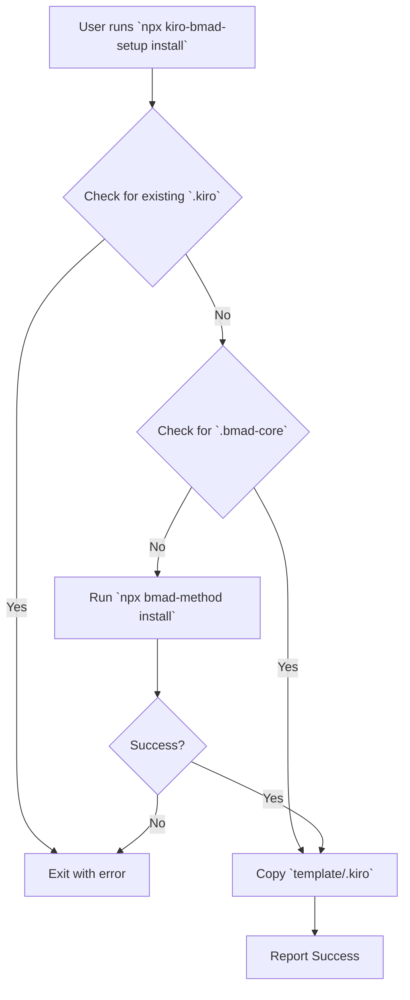

# Kiro BMAD Setup Architecture Document

## 1. Introduction
This document outlines the project architecture for the `kiro-bmad-setup` NPX installer. The primary goal is to provide a robust, cross-platform command-line tool that automates the integration of the BMAD methodology into a Kiro IDE project. The architecture is designed for simplicity, reliability, and minimal dependencies.

### 1.1. Starter Template or Existing Project
N/A. This is a new greenfield project.

### 1.2. Change Log
| Date | Version | Description | Author |
|---|---|---|---|
| 2025-08-29 | 1.0 | Initial architecture draft | Gemini |

## 2. High Level Architecture

### 2.1. Technical Summary
The system is a command-line interface (CLI) package, published to NPM and executed via `npx`. Its architecture is a single, sequential process flow that performs a series of checks and file operations. It validates the project environment, ensures necessary dependencies are present, and copies a boilerplate template. The core pattern is a procedural script that executes a chain of commands, with clear error handling at each step.

### 2.2. High Level Overview
The architecture is a **Monorepo** containing a single CLI package. The primary user interaction is invoking the `install` command. The script then executes the following logical flow:
1.  Parse the `install` command.
2.  Check if a `.kiro` directory already exists. If so, exit with an error.
3.  Check if a `.bmad-core` directory exists.
4.  If `.bmad-core` is missing, execute `npx bmad-method install` as a subprocess.
5.  If the subprocess fails, exit with an error.
6.  Copy the `template/.kiro` directory from the package to the user's project root.
7.  Report final success.

### 2.3. High Level Project Diagram


## 3. Tech Stack

| Category | Technology | Version | Purpose | Rationale |
|---|---|---|---|---|
| **Language** | TypeScript | ~5.4.5 | Primary development language | Strong typing for robust and maintainable code. |
| **Runtime** | Node.js | >=18.0.0 | JavaScript runtime for the CLI | Cross-platform compatibility and access to NPM ecosystem. |
| **CLI Framework** | commander.js | ~12.1.0 | Command-line argument parsing | Simple and powerful API for defining commands and options. |
| **File System** | fs-extra | ~11.2.0 | Enhanced file system operations | Provides promise-based, reliable file operations like `copy`. |
| **Subprocesses** | execa | ~9.0.0 | Process execution | Better subprocess management than native `child_process`. |
| **Dev Deps** | ts-node, jest | latest | Development and testing | Standard tooling for TypeScript projects. |

## 4. Components

### 1. CLI Entrypoint (`bin/index.ts`)
*   **Responsibility:** The main executable file for the NPX command. Sets up the CLI program.
*   **Key Interfaces:** Defines the `install` command using `commander.js`.
*   **Dependencies:** `commander.js`, `InstallerService`.
*   **Technology Stack:** TypeScript, Node.js.

### 2. InstallerService (`src/InstallerService.ts`)
*   **Responsibility:** Contains the core business logic for the installation process.
*   **Key Interfaces:** A public `run()` method that orchestrates the installation steps.
*   **Dependencies:** `fs-extra`, `execa`.
*   **Technology Stack:** TypeScript.

## 5. Source Tree
```plaintext
kiro-bmad-setup/
├───.git/
├───docs/
│   ├───brief.md
│   └───prd.md
├───node_modules/
├───src/
│   ├───index.ts         # Main application logic
│   └───utils.ts         # Helper functions (e.g., logging)
├───template/
│   └───.kiro/           # The boilerplate to be copied
│       └───...          # (contents of .kiro)
├───bin/
│   └───cli.js           # Compiled entrypoint for NPX
├───package.json
├───tsconfig.json
└───jest.config.js
```

## 6. Infrastructure and Deployment
*   **Infrastructure:** The package will be published to the public NPM registry.
*   **Deployment Strategy:** A CI/CD pipeline using GitHub Actions will automate testing, building, and publishing to NPM upon new version tags.

## 7. Coding Standards
*   **Style & Linting:** ESLint with Prettier for consistent code style.
*   **Naming Conventions:** `camelCase` for variables and functions, `PascalCase` for classes and types.
*   **Critical Rules:**
    *   All asynchronous operations must use `async/await`.
    *   All file system paths must be resolved to absolute paths to avoid ambiguity.
    *   Subprocess outputs (`stdout`, `stderr`) must be piped to the main process to provide user feedback.

## 8. Test Strategy and Standards
*   **Approach:** Test-after development for this simple project.
*   **Unit Tests:** Jest will be used to test the logic within `InstallerService` (e.g., checking for files). Mocks will be used for file system and subprocess calls.
*   **Integration Tests:** A test script will execute the compiled CLI in a temporary directory to verify the end-to-end installation process.
*   **File Convention:** `*.test.ts` for all test files.
*   **Location:** Tests will be co-located with the source files in a `__tests__` directory.
