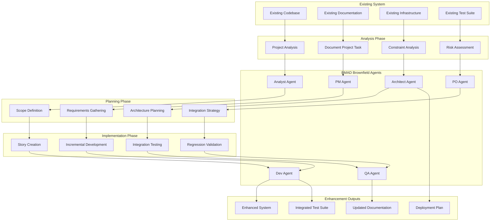

# Brownfield Workflow Design

## Overview

This design document outlines the architecture for the BMAD Brownfield Workflow, which manages the enhancement of existing projects through comprehensive analysis, careful integration planning, and risk-aware implementation strategies.

The design emphasizes preservation of existing functionality while enabling seamless integration of new features, following BMAD principles adapted for the unique challenges and constraints of working with established codebases.

## Architecture

### Brownfield Workflow Architecture



### Brownfield-Specific Workflow Phases

The brownfield workflow consists of specialized phases that account for existing system constraints:

1. **Analysis Phase**: Comprehensive understanding of existing system
2. **Planning Phase**: Integration-focused requirements and architecture
3. **Implementation Phase**: Risk-aware incremental development
4. **Validation Phase**: Comprehensive testing including regression validation

## Components and Interfaces

### 1. Existing System Analysis Component

#### Purpose
Provides comprehensive understanding of existing project structure, architecture, constraints, and technical debt to inform enhancement planning.

#### Key Interfaces
- **Input**: Existing codebase, documentation, infrastructure, test suite
- **Output**: Project analysis, constraint documentation, risk assessment

#### Implementation Details
- Integrates with document-project task when available
- Analyzes current tech stack, architecture patterns, and deployment methods
- Identifies technical debt, known issues, and system limitations
- Documents existing coding standards and patterns
- Validates findings with user before proceeding

### 2. Enhancement Scope Assessment Component

#### Purpose
Evaluates enhancement complexity and determines appropriate workflow approach while assessing impact on existing system.

#### Key Interfaces
- **Input**: Enhancement requirements, existing system analysis
- **Output**: Scope classification, impact assessment, workflow recommendation

#### Implementation Details
- Classifies enhancements by type (new feature, modification, integration, etc.)
- Assesses impact levels (minimal, moderate, significant, major)
- Recommends full PRD workflow vs simple epic/story approach
- Documents enhancement goals in brownfield context
- Establishes integration requirements and constraints

### 3. Compatibility Requirements Component

#### Purpose
Defines comprehensive compatibility and integration requirements to ensure seamless integration with existing functionality.

#### Key Interfaces
- **Input**: Existing system analysis, enhancement scope
- **Output**: Compatibility requirements, integration constraints, risk mitigation strategies

#### Implementation Details
- Creates functional requirements considering existing functionality integration
- Defines non-functional requirements with existing system performance constraints
- Establishes compatibility requirements for APIs, database schema, UI/UX, and integrations
- Plans integration strategies for database, API, frontend, and testing
- Identifies and documents technical, integration, and deployment risks

### 4. Brownfield Architecture Integration Component

#### Purpose
Designs architecture that integrates new components with existing systems while maintaining consistency and architectural integrity.

#### Key Interfaces
- **Input**: Existing architecture analysis, compatibility requirements
- **Output**: Integration architecture, component design, deployment strategy

#### Implementation Details
- Aligns with existing technology stack and architectural patterns
- Justifies new technology introductions with clear rationale
- Designs data models with existing schema integration and backward compatibility
- Plans component architecture following existing patterns and interfaces
- Maintains API consistency with existing patterns and authentication
- Integrates with existing infrastructure and deployment pipelines

### 5. Risk-Aware Story Planning Component

#### Purpose
Structures enhancement work into stories that minimize risk to existing functionality while delivering incremental value.

#### Key Interfaces
- **Input**: Architecture design, compatibility requirements, risk assessment
- **Output**: Epic structure, story sequence, integration verification plans

#### Implementation Details
- Favors single comprehensive epic for focused enhancements
- Sequences stories to minimize risk to existing system
- Includes verification of existing functionality in each story
- Defines acceptance criteria covering both new and existing functionality
- Plans integration verification steps for each story
- Accounts for additional complexity of existing codebase constraints

### 6. Quality Assurance and Validation Component

#### Purpose
Ensures comprehensive validation that both new functionality works correctly and existing functionality remains unaffected.

#### Key Interfaces
- **Input**: Implementation artifacts, existing test suite, integration requirements
- **Output**: QA results, regression validation, deployment approval

#### Implementation Details
- Integrates with existing test suite and frameworks
- Performs regression testing to verify existing functionality integrity
- Validates new component integration with existing systems
- Ensures security testing doesn't introduce vulnerabilities
- Validates deployment procedures and rollback capabilities
- Documents QA results addressing both new and existing functionality

## Data Models

### Existing System Analysis Model
```
ExistingSystemAnalysis:
  - projectOverview: ProjectOverview
  - documentationAnalysis: DocumentationAnalysis
  - constraintAnalysis: ConstraintAnalysis
  - riskAssessment: RiskAssessment

ProjectOverview:
  - currentPurpose: String
  - techStackSummary: String
  - architectureStyle: String
  - deploymentApproach: String

DocumentationAnalysis:
  - availableDocuments: List<Document>
  - documentationGaps: List<String>
  - documentProjectStatus: Boolean

ConstraintAnalysis:
  - technicalConstraints: List<Constraint>
  - performanceConstraints: List<Constraint>
  - integrationConstraints: List<Constraint>
  - deploymentConstraints: List<Constraint>
```

### Enhancement Scope Model
```
EnhancementScope:
  - enhancementType: EnhancementType
  - impactLevel: ImpactLevel
  - scopeDescription: String
  - integrationRequirements: List<IntegrationRequirement>

EnhancementType:
  - NEW_FEATURE
  - MAJOR_MODIFICATION
  - SYSTEM_INTEGRATION
  - PERFORMANCE_IMPROVEMENT
  - TECHNOLOGY_UPGRADE
  - BUG_FIX_STABILITY

ImpactLevel:
  - MINIMAL
  - MODERATE
  - SIGNIFICANT
  - MAJOR
```

### Compatibility Requirements Model
```
CompatibilityRequirements:
  - functionalRequirements: List<FunctionalRequirement>
  - nonFunctionalRequirements: List<NonFunctionalRequirement>
  - compatibilityRequirements: List<CompatibilityRequirement>
  - integrationStrategies: IntegrationStrategies

CompatibilityRequirement:
  - id: String (CR prefix)
  - category: CompatibilityCategory
  - description: String
  - validationCriteria: String

CompatibilityCategory:
  - API_COMPATIBILITY
  - DATABASE_SCHEMA_COMPATIBILITY
  - UI_UX_CONSISTENCY
  - INTEGRATION_COMPATIBILITY

IntegrationStrategies:
  - databaseIntegration: String
  - apiIntegration: String
  - frontendIntegration: String
  - testingIntegration: String
```

### Brownfield Architecture Model
```
BrownfieldArchitecture:
  - existingSystemIntegration: ExistingSystemIntegration
  - newComponents: List<Component>
  - integrationPoints: List<IntegrationPoint>
  - deploymentStrategy: DeploymentStrategy

ExistingSystemIntegration:
  - techStackAlignment: TechStackAlignment
  - architecturalPatterns: List<ArchitecturalPattern>
  - integrationApproach: IntegrationApproach

IntegrationPoint:
  - name: String
  - type: IntegrationType
  - existingComponent: String
  - newComponent: String
  - integrationMethod: String
  - riskLevel: RiskLevel
```

### Risk-Aware Story Model
```
BrownfieldStory:
  - story: Story
  - integrationVerification: List<IntegrationVerification>
  - riskMitigation: List<RiskMitigation>
  - rollbackPlan: RollbackPlan

IntegrationVerification:
  - id: String (IV prefix)
  - description: String
  - existingFunctionalityCheck: String
  - integrationPointValidation: String
  - performanceImpactCheck: String

RiskMitigation:
  - riskType: RiskType
  - mitigationStrategy: String
  - contingencyPlan: String

RollbackPlan:
  - rollbackTriggers: List<String>
  - rollbackProcedure: String
  - recoveryTime: Duration
```

## Error Handling

### Analysis Phase Errors
- Insufficient existing documentation for analysis
- Inability to access existing codebase or infrastructure
- Conflicting information between documentation and actual system
- Missing critical system information for enhancement planning

### Planning Phase Errors
- Incompatible enhancement requirements with existing system constraints
- Insufficient compatibility requirement definition
- Architecture integration conflicts with existing patterns
- Risk assessment incomplete or inadequate

### Implementation Phase Errors
- Integration failures with existing components
- Regression issues affecting existing functionality
- Performance degradation in existing system
- Deployment conflicts with existing infrastructure

### Recovery Procedures
- Rollback to previous system state with minimal downtime
- Incremental rollback of individual story implementations
- Context preservation during error recovery and system restoration
- Guided troubleshooting for integration and compatibility issues

## Testing Strategy

### Existing System Integration Testing
- Validate existing system analysis accuracy
- Test document-project integration and output utilization
- Verify constraint identification and risk assessment accuracy
- Test compatibility requirement completeness

### Enhancement Planning Testing
- Test scope assessment accuracy and workflow recommendations
- Validate architecture integration design with existing patterns
- Test story sequencing for risk minimization
- Verify integration verification plan effectiveness

### Implementation Testing
- Test incremental development with existing system preservation
- Validate regression testing effectiveness
- Test rollback procedures and system recovery
- Verify deployment integration with existing infrastructure

### Quality Assurance Testing
- Test comprehensive validation procedures
- Verify both new functionality and existing system integrity
- Test security validation for existing system protection
- Validate documentation updates and accuracy

#[[file:.bmad-core/tasks/document-project.md]]
#[[file:.bmad-core/tasks/brownfield-create-epic.md]]
#[[file:.bmad-core/tasks/brownfield-create-story.md]]