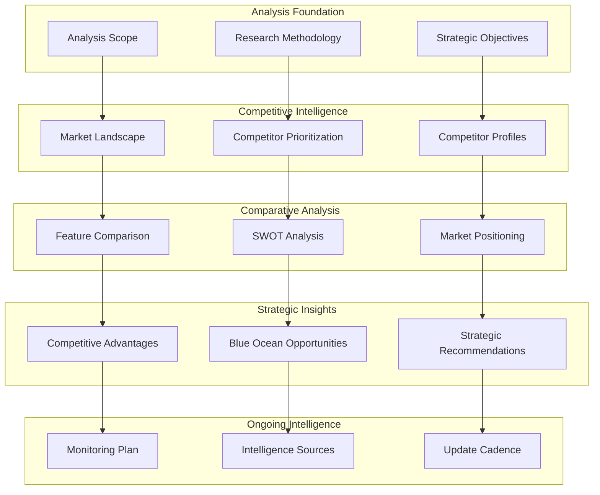

# Competitive Analysis Report - Design

## Overview

This design document outlines the structure and methodology for creating comprehensive competitive analysis reports following BMAD methodology. The design ensures systematic analysis of competitive landscapes, strategic positioning assessment, and actionable recommendations for competitive advantage.

## Architecture

### Competitive Analysis Framework



### Analysis Methodology Design

The competitive analysis follows a structured approach:

1. **Foundation Setting**: Define scope, methodology, and objectives
2. **Intelligence Gathering**: Collect and organize competitive data
3. **Systematic Analysis**: Apply analytical frameworks consistently
4. **Strategic Synthesis**: Derive actionable insights and recommendations
5. **Monitoring Framework**: Establish ongoing competitive intelligence

## Components and Interfaces

### Analysis Framework Components

#### 1. Scope Definition Component
**Purpose**: Establish boundaries and objectives for competitive analysis
**Interfaces**:
- Strategic objective alignment with business goals
- Competitor categorization and prioritization
- Research methodology and data sources
- Analysis limitations and assumptions

#### 2. Competitive Intelligence Component
**Purpose**: Gather and organize competitor information systematically
**Interfaces**:
- Market landscape overview and structure
- Competitor prioritization matrix (2x2: Market Share vs Strategic Threat)
- Detailed competitor profiles with standardized format
- Data validation and confidence assessment

#### 3. Comparative Analysis Component
**Purpose**: Compare competitors across key dimensions
**Interfaces**:
- Feature comparison matrix with standardized criteria
- SWOT analysis framework for strategic positioning
- Market positioning maps on relevant dimensions
- Quantitative and qualitative comparison metrics

#### 4. Strategic Insight Component
**Purpose**: Derive actionable strategic recommendations
**Interfaces**:
- Competitive advantage assessment framework
- Blue ocean opportunity identification
- Strategic recommendation development
- Risk and opportunity prioritization

#### 5. Monitoring System Component
**Purpose**: Establish ongoing competitive intelligence
**Interfaces**:
- Key competitor tracking framework
- Intelligence source management
- Update cadence and review schedule
- Alert system for significant changes

### Data Model Design

#### Competitor Profile Data Structure
```typescript
interface CompetitorProfile {
  // Basic Information
  id: string;
  name: string;
  priority: 'Priority 1' | 'Priority 2' | 'Priority 3' | 'Priority 4';
  
  // Company Overview
  companyOverview: {
    founded: string;
    headquarters: string;
    companySize: string;
    funding: FundingInfo;
    leadership: ExecutiveInfo[];
  };
  
  // Business Model
  businessModel: {
    revenueModel: string;
    targetMarket: string[];
    valueProposition: string;
    goToMarketStrategy: string;
    strategicFocus: string[];
  };
  
  // Product Analysis
  productAnalysis: {
    coreOfferings: string[];
    keyFeatures: string[];
    userExperience: string;
    technologyStack: string[];
    pricing: PricingModel;
  };
  
  // Strategic Assessment
  strengths: string[];
  weaknesses: string[];
  marketPosition: MarketPosition;
  
  // Metadata
  lastUpdated: Date;
  confidenceLevel: 'High' | 'Medium' | 'Low';
  dataSources: string[];
}

interface MarketPosition {
  marketShare: string;
  customerBase: string;
  growthTrajectory: string;
  recentDevelopments: string[];
}

interface PricingModel {
  model: string;
  startingPrice: string;
  freeTier: boolean;
  pricingTiers: PricingTier[];
}
```

#### Feature Comparison Data Structure
```typescript
interface FeatureComparison {
  categories: FeatureCategory[];
  competitors: string[];
  lastUpdated: Date;
}

interface FeatureCategory {
  name: string;
  features: Feature[];
}

interface Feature {
  name: string;
  description: string;
  competitorRatings: Record<string, FeatureRating>;
}

interface FeatureRating {
  status: 'Available' | 'Limited' | 'Not Available' | 'Unknown';
  rating: number; // 1-5 scale
  notes: string;
}
```

#### Strategic Recommendation Data Structure
```typescript
interface StrategyRecommendation {
  category: 'Differentiation' | 'Offensive' | 'Defensive' | 'Partnership';
  priority: 'High' | 'Medium' | 'Low';
  recommendation: string;
  rationale: string;
  requiredResources: string[];
  expectedOutcome: string;
  risks: string[];
  timeline: string;
}
```

## Data Models

### Competitive Analysis Data Architecture

#### Prioritization Matrix Model
```typescript
interface PrioritizationMatrix {
  quadrants: {
    priority1: CompetitorSummary[]; // High Market Share + High Threat
    priority2: CompetitorSummary[]; // Low Market Share + High Threat
    priority3: CompetitorSummary[]; // High Market Share + Low Threat
    priority4: CompetitorSummary[]; // Low Market Share + Low Threat
  };
  criteria: {
    marketShareThreshold: number;
    threatAssessmentCriteria: string[];
  };
}

interface CompetitorSummary {
  name: string;
  marketShare: number;
  threatLevel: number;
  rationale: string;
}
```

#### SWOT Analysis Model
```typescript
interface SWOTAnalysis {
  yourSolution: {
    strengths: string[];
    weaknesses: string[];
    opportunities: string[];
    threats: string[];
  };
  competitorComparison: {
    competitorName: string;
    yourAdvantages: string[];
    theirAdvantages: string[];
    differentiationOpportunities: string[];
  }[];
}
```

#### Market Positioning Model
```typescript
interface MarketPositioning {
  dimensions: {
    xAxis: PositioningDimension;
    yAxis: PositioningDimension;
  };
  competitors: CompetitorPosition[];
  marketGaps: MarketGap[];
}

interface PositioningDimension {
  name: string;
  lowEnd: string;
  highEnd: string;
  scale: number; // 1-10
}

interface CompetitorPosition {
  name: string;
  xValue: number;
  yValue: number;
  rationale: string;
}

interface MarketGap {
  description: string;
  xRange: [number, number];
  yRange: [number, number];
  opportunity: string;
}
```

## Error Handling

### Analysis Quality Assurance

#### Data Validation Strategy
```typescript
interface ValidationResult {
  isValid: boolean;
  errors: ValidationError[];
  warnings: ValidationWarning[];
  confidenceScore: number;
}

interface ValidationError {
  field: string;
  message: string;
  severity: 'Critical' | 'High' | 'Medium';
}

interface ValidationWarning {
  field: string;
  message: string;
  recommendation: string;
}
```

#### Quality Control Measures
- **Data Source Verification**: Validate information sources and recency
- **Consistency Checks**: Ensure consistent competitor assessment across sections
- **Completeness Validation**: Verify all required sections are populated
- **Bias Detection**: Identify potential analytical biases and assumptions
- **Stakeholder Review**: Require review by multiple stakeholders

### Error Recovery Patterns

#### Incomplete Data Recovery
- **Missing Information**: Flag gaps and suggest additional research
- **Outdated Information**: Highlight stale data and recommend updates
- **Conflicting Information**: Document conflicts and provide resolution guidance
- **Low Confidence Data**: Mark uncertain information and suggest validation

#### Analysis Consistency Recovery
- **Inconsistent Ratings**: Identify and resolve rating inconsistencies
- **Contradictory Conclusions**: Highlight logical conflicts and request clarification
- **Missing Connections**: Identify gaps between analysis and recommendations
- **Unsupported Claims**: Flag recommendations without supporting evidence

## Testing Strategy

### Analysis Validation Framework

#### Content Quality Testing
1. **Completeness Testing**: Verify all required sections are populated
2. **Accuracy Testing**: Validate information against multiple sources
3. **Consistency Testing**: Check for internal consistency across sections
4. **Relevance Testing**: Ensure analysis aligns with strategic objectives

#### Analytical Rigor Testing
1. **Framework Application**: Verify proper use of analytical frameworks
2. **Logic Validation**: Check reasoning and conclusion validity
3. **Bias Assessment**: Identify potential analytical biases
4. **Evidence Support**: Validate claims with supporting evidence

#### Strategic Value Testing
1. **Actionability Testing**: Ensure recommendations are actionable
2. **Strategic Alignment**: Verify alignment with business objectives
3. **Competitive Advantage**: Assess potential for competitive advantage
4. **Implementation Feasibility**: Evaluate recommendation feasibility

### Quality Assurance Process

#### Review Checkpoints
- **Data Collection Review**: Validate sources and information quality
- **Analysis Review**: Check analytical rigor and framework application
- **Strategic Review**: Assess strategic value and recommendation quality
- **Stakeholder Review**: Obtain feedback from key stakeholders

#### Continuous Improvement
- **Feedback Integration**: Incorporate stakeholder feedback systematically
- **Methodology Refinement**: Improve analysis methods based on outcomes
- **Template Evolution**: Update templates based on usage patterns
- **Best Practice Sharing**: Document and share successful analysis approaches

---

**Template Reference:**
#[[file:.bmad-core/templates/competitor-analysis-tmpl.yaml]]