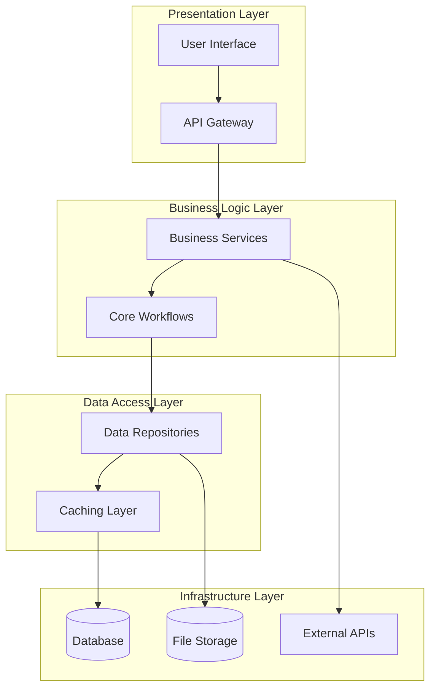

# System Architecture Document - Design

## Overview

This design document transforms architectural requirements into a concrete technical blueprint. The design provides detailed specifications for all system components, their interactions, and implementation guidelines for AI-driven development.

## Architecture

### Layered Architecture Design



### Component Interaction Design

The architecture follows a modular design where:
- **Clear Separation**: Each layer has distinct responsibilities
- **Loose Coupling**: Components interact through well-defined interfaces
- **High Cohesion**: Related functionality is grouped together
- **Scalability**: Components can be scaled independently
- **Testability**: Each component can be tested in isolation

## Components and Interfaces

### Core System Components

#### 1. API Gateway Component
**Purpose**: Single entry point for all client requests
**Interfaces**:
- REST/GraphQL endpoints for client communication
- Authentication and authorization middleware
- Rate limiting and request validation
- Response formatting and error handling

#### 2. Business Services Component
**Purpose**: Core business logic implementation
**Interfaces**:
- Service layer APIs for business operations
- Domain model implementations
- Business rule validation
- Transaction management

#### 3. Data Access Component
**Purpose**: Abstract data persistence operations
**Interfaces**:
- Repository pattern implementations
- Database connection management
- Query optimization and caching
- Data validation and transformation

#### 4. External Integration Component
**Purpose**: Manage third-party service interactions
**Interfaces**:
- External API client implementations
- Circuit breaker and retry logic
- Response caching and transformation
- Error handling and fallback mechanisms

### Interface Design Patterns

#### Service Interface Pattern
```typescript
interface ServiceInterface<T, K> {
  create(entity: T): Promise<T>;
  findById(id: K): Promise<T | null>;
  update(id: K, updates: Partial<T>): Promise<T>;
  delete(id: K): Promise<boolean>;
  findAll(filters?: FilterOptions): Promise<T[]>;
}
```

#### Repository Interface Pattern
```typescript
interface RepositoryInterface<T, K> {
  save(entity: T): Promise<T>;
  findById(id: K): Promise<T | null>;
  findBy(criteria: SearchCriteria): Promise<T[]>;
  update(entity: T): Promise<T>;
  remove(id: K): Promise<boolean>;
}
```

## Data Models

### Core Entity Design

#### Domain Model Structure
```typescript
// Base Entity Interface
interface BaseEntity {
  id: string;
  createdAt: Date;
  updatedAt: Date;
  version: number;
}

// Example Business Entity
interface UserEntity extends BaseEntity {
  email: string;
  username: string;
  profile: UserProfile;
  preferences: UserPreferences;
}

// Value Objects
interface UserProfile {
  firstName: string;
  lastName: string;
  avatar?: string;
}

interface UserPreferences {
  theme: 'light' | 'dark';
  notifications: NotificationSettings;
}
```

### Database Schema Design

#### Relational Schema (if SQL database chosen)
```sql
-- Users table
CREATE TABLE users (
    id UUID PRIMARY KEY DEFAULT gen_random_uuid(),
    email VARCHAR(255) UNIQUE NOT NULL,
    username VARCHAR(100) UNIQUE NOT NULL,
    password_hash VARCHAR(255) NOT NULL,
    created_at TIMESTAMP DEFAULT CURRENT_TIMESTAMP,
    updated_at TIMESTAMP DEFAULT CURRENT_TIMESTAMP,
    version INTEGER DEFAULT 1
);

-- User profiles table
CREATE TABLE user_profiles (
    id UUID PRIMARY KEY DEFAULT gen_random_uuid(),
    user_id UUID REFERENCES users(id) ON DELETE CASCADE,
    first_name VARCHAR(100),
    last_name VARCHAR(100),
    avatar_url TEXT,
    created_at TIMESTAMP DEFAULT CURRENT_TIMESTAMP,
    updated_at TIMESTAMP DEFAULT CURRENT_TIMESTAMP
);

-- Indexes for performance
CREATE INDEX idx_users_email ON users(email);
CREATE INDEX idx_users_username ON users(username);
CREATE INDEX idx_user_profiles_user_id ON user_profiles(user_id);
```

#### Document Schema (if NoSQL database chosen)
```json
{
  "_id": "ObjectId",
  "email": "string (unique)",
  "username": "string (unique)",
  "passwordHash": "string",
  "profile": {
    "firstName": "string",
    "lastName": "string",
    "avatarUrl": "string"
  },
  "preferences": {
    "theme": "light|dark",
    "notifications": {
      "email": "boolean",
      "push": "boolean"
    }
  },
  "createdAt": "Date",
  "updatedAt": "Date",
  "version": "number"
}
```

## Error Handling

### Error Handling Strategy

#### Error Classification
```typescript
// Error Types
enum ErrorType {
  VALIDATION = 'VALIDATION',
  AUTHENTICATION = 'AUTHENTICATION',
  AUTHORIZATION = 'AUTHORIZATION',
  NOT_FOUND = 'NOT_FOUND',
  CONFLICT = 'CONFLICT',
  EXTERNAL_SERVICE = 'EXTERNAL_SERVICE',
  INTERNAL_SERVER = 'INTERNAL_SERVER'
}

// Base Error Interface
interface ApplicationError {
  type: ErrorType;
  message: string;
  code: string;
  details?: Record<string, any>;
  timestamp: Date;
  correlationId: string;
}
```

#### Error Handling Patterns

**1. Input Validation Errors**
- Validate all external inputs at API boundary
- Use schema validation libraries
- Return structured error responses
- Log validation failures for monitoring

**2. Business Logic Errors**
- Throw domain-specific exceptions
- Include context and recovery suggestions
- Map to appropriate HTTP status codes
- Maintain error traceability

**3. External Service Errors**
- Implement circuit breaker pattern
- Use exponential backoff for retries
- Provide fallback mechanisms
- Log external service failures

**4. Database Errors**
- Handle connection failures gracefully
- Implement transaction rollback
- Provide meaningful error messages
- Monitor database performance

### Logging and Monitoring Design

#### Structured Logging Format
```json
{
  "timestamp": "2024-01-26T10:30:00Z",
  "level": "ERROR",
  "service": "user-service",
  "correlationId": "abc-123-def",
  "userId": "user-456",
  "operation": "createUser",
  "error": {
    "type": "VALIDATION",
    "message": "Email already exists",
    "code": "USER_EMAIL_DUPLICATE"
  },
  "duration": 150,
  "metadata": {
    "endpoint": "/api/users",
    "method": "POST",
    "userAgent": "Mozilla/5.0..."
  }
}
```

## Testing Strategy

### Testing Architecture Design

#### Test Pyramid Implementation
```
        E2E Tests (10%)
       /              \
    Integration Tests (20%)
   /                    \
  Unit Tests (70%)
```

#### Test Organization Structure
```
tests/
├── unit/                   # Unit tests (70% of tests)
│   ├── services/          # Business logic tests
│   ├── repositories/      # Data access tests
│   ├── utils/            # Utility function tests
│   └── models/           # Domain model tests
├── integration/           # Integration tests (20% of tests)
│   ├── api/              # API endpoint tests
│   ├── database/         # Database integration tests
│   └── external/         # External service tests
├── e2e/                  # End-to-end tests (10% of tests)
│   ├── user-flows/       # Critical user journey tests
│   └── smoke/            # Basic functionality tests
├── fixtures/             # Test data and mocks
└── helpers/              # Test utilities and setup
```

#### Test Implementation Patterns

**Unit Test Example:**
```typescript
describe('UserService', () => {
  let userService: UserService;
  let mockRepository: jest.Mocked<UserRepository>;

  beforeEach(() => {
    mockRepository = createMockRepository();
    userService = new UserService(mockRepository);
  });

  describe('createUser', () => {
    it('should create user with valid data', async () => {
      // Arrange
      const userData = { email: 'test@example.com', username: 'testuser' };
      mockRepository.save.mockResolvedValue({ id: '123', ...userData });

      // Act
      const result = await userService.createUser(userData);

      // Assert
      expect(result).toEqual({ id: '123', ...userData });
      expect(mockRepository.save).toHaveBeenCalledWith(userData);
    });
  });
});
```

**Integration Test Example:**
```typescript
describe('User API Integration', () => {
  let app: Application;
  let database: Database;

  beforeAll(async () => {
    app = await createTestApp();
    database = await setupTestDatabase();
  });

  afterAll(async () => {
    await cleanupTestDatabase(database);
  });

  it('should create user via API', async () => {
    const userData = { email: 'test@example.com', username: 'testuser' };
    
    const response = await request(app)
      .post('/api/users')
      .send(userData)
      .expect(201);

    expect(response.body).toMatchObject(userData);
    
    // Verify in database
    const user = await database.users.findByEmail(userData.email);
    expect(user).toBeTruthy();
  });
});
```

### Quality Assurance Design

#### Code Quality Metrics
- **Test Coverage**: Minimum 80% overall, 90% for critical paths
- **Code Complexity**: Cyclomatic complexity < 10 per function
- **Duplication**: < 3% code duplication
- **Performance**: API response time < 200ms for 95th percentile

#### Continuous Quality Checks
- Automated testing in CI/CD pipeline
- Code quality gates before deployment
- Security vulnerability scanning
- Performance regression testing

---

**Template Reference:**
#[[file:.bmad-core/templates/architecture-tmpl.yaml]]