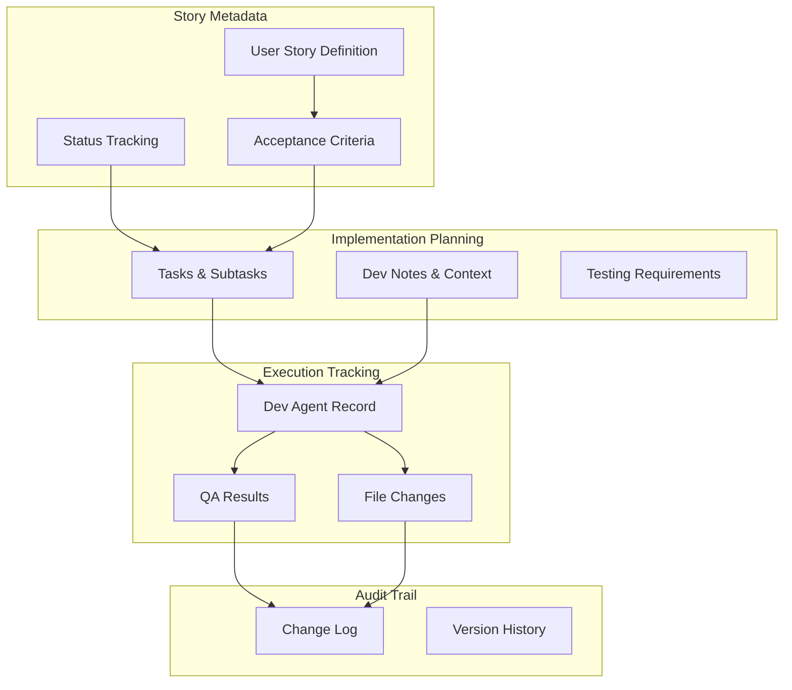

# User Story Document - Design

## Overview

This design document defines the structure and workflow for individual user story documents in BMAD methodology. The design ensures stories are properly sized, technically complete, and support efficient AI-driven development.

## Architecture

### Story Document Architecture



### Agent Workflow Design

The story follows a structured agent workflow:

1. **Scrum Master Phase**: Creates story structure, defines tasks, provides context
2. **Development Phase**: Dev agent implements, tracks progress, records changes
3. **Quality Assurance Phase**: QA agent reviews, validates, approves completion
4. **Status Management**: Explicit approvals required between phases

## Components and Interfaces

### Story Structure Components

#### 1. Story Definition Component
**Purpose**: Define the user story and acceptance criteria
**Owner**: Scrum Master agent
**Interfaces**:
- Standard user story format (As a/I want/so that)
- Numbered acceptance criteria from epic
- Clear value proposition and benefit statement

#### 2. Implementation Planning Component
**Purpose**: Break down story into actionable tasks
**Owner**: Scrum Master agent (creation), Dev agent (updates)
**Interfaces**:
- Hierarchical task/subtask structure
- Acceptance criteria traceability
- Technical context and requirements

#### 3. Development Context Component
**Purpose**: Provide complete technical context for implementation
**Owner**: Scrum Master agent
**Interfaces**:
- Relevant architecture information
- Source tree context
- Testing standards and requirements
- Previous story dependencies

#### 4. Execution Tracking Component
**Purpose**: Track development progress and changes
**Owner**: Dev agent
**Interfaces**:
- Agent model and version tracking
- File change documentation
- Completion notes and issue tracking
- Debug log references

#### 5. Quality Validation Component
**Purpose**: Document QA review and approval
**Owner**: QA agent
**Interfaces**:
- Review results and findings
- Issue tracking and resolution
- Approval status and recommendations

### Interface Design Patterns

#### Status Transition Interface
```typescript
enum StoryStatus {
  DRAFT = 'Draft',
  APPROVED = 'Approved', 
  IN_PROGRESS = 'InProgress',
  REVIEW = 'Review',
  DONE = 'Done'
}

interface StatusTransition {
  from: StoryStatus;
  to: StoryStatus;
  requiredApproval: boolean;
  allowedAgents: AgentType[];
}
```

#### Task Structure Interface
```typescript
interface Task {
  id: string;
  description: string;
  acceptanceCriteria: string[];
  completed: boolean;
  subtasks: Subtask[];
}

interface Subtask {
  id: string;
  description: string;
  completed: boolean;
  notes?: string;
}
```

## Data Models

### Story Document Data Model

```typescript
interface StoryDocument {
  // Metadata
  id: string;
  epicNumber: number;
  storyNumber: number;
  title: string;
  status: StoryStatus;
  
  // Story Definition
  story: UserStory;
  acceptanceCriteria: AcceptanceCriterion[];
  
  // Implementation
  tasks: Task[];
  devNotes: DevelopmentNotes;
  testingRequirements: TestingRequirements;
  
  // Execution Tracking
  devAgentRecord: DevAgentRecord;
  qaResults: QAResults;
  
  // Audit
  changeLog: ChangeLogEntry[];
  createdAt: Date;
  updatedAt: Date;
}

interface UserStory {
  role: string;
  action: string;
  benefit: string;
}

interface AcceptanceCriterion {
  id: number;
  description: string;
  testable: boolean;
}

interface DevelopmentNotes {
  sourceTreeInfo: string;
  architectureReferences: string[];
  previousStoryNotes: string;
  testingStandards: TestingStandards;
}

interface DevAgentRecord {
  agentModel: string;
  debugLogReferences: string[];
  completionNotes: string[];
  fileList: FileChange[];
}

interface FileChange {
  path: string;
  action: 'created' | 'modified' | 'deleted';
  description: string;
}

interface QAResults {
  reviewDate: Date;
  issues: QAIssue[];
  approved: boolean;
  recommendations: string[];
}
```

## Error Handling

### Story Validation Strategy

#### Status Transition Validation
- Verify required approvals before status changes
- Validate agent permissions for status updates
- Ensure all prerequisites are met for each transition
- Prevent invalid status transitions

#### Task Completion Validation
- Verify all tasks are completed before marking story as done
- Validate acceptance criteria are satisfied
- Ensure testing requirements are met
- Check code quality standards compliance

#### Agent Permission Validation
- Enforce agent ownership of document sections
- Prevent unauthorized modifications
- Validate agent capabilities for assigned tasks
- Ensure proper handoffs between agents

### Error Recovery Patterns

#### Incomplete Story Recovery
- Identify missing required sections
- Provide templates for incomplete areas
- Guide agents through completion process
- Validate story readiness before approval

#### Failed Implementation Recovery
- Document implementation issues and blockers
- Provide rollback procedures for failed changes
- Guide troubleshooting and debugging process
- Support story scope adjustment if needed

#### Quality Gate Failures
- Document QA issues and required fixes
- Provide clear remediation guidance
- Support iterative improvement process
- Track resolution of quality issues

## Testing Strategy

### Story Document Testing

#### Structure Validation Testing
1. **Format Testing**: Verify story follows standard user story format
2. **Completeness Testing**: Ensure all required sections are populated
3. **Traceability Testing**: Validate links to acceptance criteria and epic
4. **Agent Permission Testing**: Verify proper section ownership

#### Workflow Testing
1. **Status Transition Testing**: Validate proper status progression
2. **Agent Handoff Testing**: Ensure smooth transitions between agents
3. **Approval Process Testing**: Verify required approvals are obtained
4. **Completion Validation Testing**: Confirm all criteria are satisfied

#### Integration Testing
1. **Epic Integration Testing**: Verify story aligns with epic requirements
2. **Architecture Integration Testing**: Ensure technical context is accurate
3. **Development Tool Integration Testing**: Validate agent workflow execution
4. **Quality Gate Integration Testing**: Confirm QA process effectiveness

### Quality Assurance

#### Story Quality Metrics
- **Completeness**: All required sections populated
- **Clarity**: Story and acceptance criteria are unambiguous
- **Testability**: All criteria can be verified objectively
- **Traceability**: Clear links to epic and PRD requirements
- **Implementability**: Story is appropriately sized for AI agent execution

#### Process Quality Metrics
- **Status Progression**: Stories follow proper workflow
- **Agent Efficiency**: Minimal context switching and rework
- **Quality Gates**: Issues caught and resolved in QA phase
- **Documentation**: Complete audit trail maintained

---

**Template Reference:**
#[[file:.bmad-core/templates/story-tmpl.yaml]]