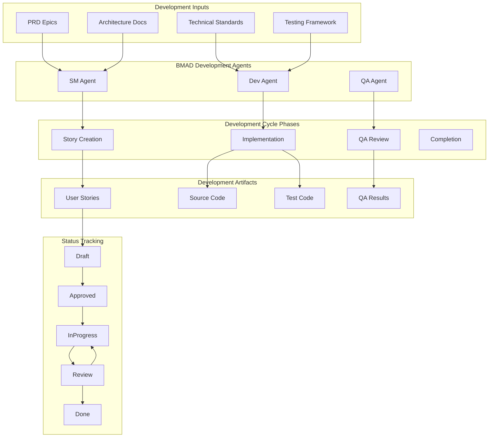
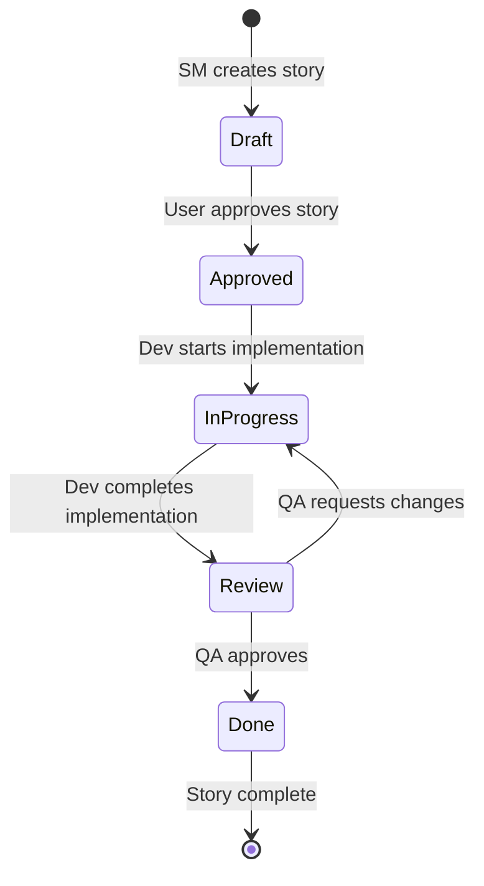

# Development Cycle Design

## Overview

This design document outlines the architecture for the BMAD Development Cycle workflow, which manages the iterative process of transforming PRD epics into implemented, tested, and reviewed code through systematic SM → Dev → QA cycles.

The design emphasizes clean handoffs between specialized agents, comprehensive context preservation, and systematic progress tracking to ensure high-quality deliverables while maintaining development velocity.

## Architecture

### Development Cycle Architecture



### Workflow State Machine

The development cycle follows a strict state machine with defined transitions:



## Components and Interfaces

### 1. Story Creation Component (SM Agent)

#### Purpose
Transforms PRD epics into detailed, implementable user stories with comprehensive context and clear acceptance criteria.

#### Key Interfaces
- **Input**: PRD epics, architecture documents, technical standards
- **Output**: User stories with tasks, subtasks, dev notes, and testing requirements

#### Implementation Details
- Uses BMAD story template structure with role-based editing permissions
- Breaks down epics into "vertical slice" stories delivering complete functionality
- Sizes stories for AI agent execution (2-4 hour completion window)
- Provides complete context in dev notes to eliminate architecture document dependencies
- References acceptance criteria numbers in tasks and subtasks for traceability

### 2. Implementation Component (Dev Agent)

#### Purpose
Implements user stories following specified tasks, subtasks, and technical standards while maintaining comprehensive documentation.

#### Key Interfaces
- **Input**: Approved user stories, technical standards, testing frameworks
- **Output**: Source code, test code, file lists, completion notes

#### Implementation Details
- Updates story status from "Approved" to "InProgress" at start
- Follows task and subtask checklist with completion tracking
- Implements testing according to architecture-specified standards
- Maintains File List of all created/modified files
- Documents agent model and version for traceability
- Records debug log references for troubleshooting
- Updates status to "Review" upon completion

### 3. QA Review Component (QA Agent)

#### Purpose
Performs comprehensive code review and quality assessment to ensure stories meet BMAD quality standards and project requirements.

#### Key Interfaces
- **Input**: Completed stories with implementation, source code, tests
- **Output**: QA results, improvement recommendations, status updates

#### Implementation Details
- Validates all acceptance criteria have been met
- Reviews code quality and adherence to coding standards
- Assesses test coverage and quality
- Documents findings and recommendations in QA Results section
- Updates status to "Done" for approved stories
- Maintains "Review" status with unchecked items for required changes

### 4. Workflow Coordination Component

#### Purpose
Manages the overall development cycle workflow, ensuring proper handoffs and systematic progress through the SM → Dev → QA cycle.

#### Key Interfaces
- **Input**: Workflow state, agent availability, story status
- **Output**: Workflow coordination, handoff management, progress tracking

#### Implementation Details
- Enforces one story in progress per developer at a time
- Manages clean context windows for agent switches
- Preserves context through comprehensive story documentation
- Facilitates issue resolution and workflow continuity
- Tracks overall epic and project progress

## Data Models

### Story Model
```
Story:
  - id: String
  - title: String
  - status: StoryStatus (Draft|Approved|InProgress|Review|Done)
  - userStory: UserStoryTemplate
  - acceptanceCriteria: List<AcceptanceCriterion>
  - tasksSubtasks: List<Task>
  - devNotes: DevNotes
  - changeLog: List<ChangeEntry>
  - devAgentRecord: DevAgentRecord
  - qaResults: QAResults

UserStoryTemplate:
  - role: String
  - action: String
  - benefit: String

Task:
  - description: String
  - completed: Boolean
  - acceptanceCriteriaRef: Optional<String>
  - subtasks: List<Subtask>

DevNotes:
  - sourceTreeInfo: String
  - previousStoryNotes: String
  - contextInfo: String
  - testingStandards: TestingStandards

DevAgentRecord:
  - agentModel: String
  - debugLogReferences: List<String>
  - completionNotes: String
  - fileList: List<String>

QAResults:
  - findings: List<Finding>
  - recommendations: List<String>
  - approved: Boolean
```

### Development Cycle State Model
```
DevelopmentCycle:
  - currentStory: Optional<Story>
  - epicProgress: EpicProgress
  - cycleMetrics: CycleMetrics

EpicProgress:
  - totalStories: Integer
  - completedStories: Integer
  - inProgressStories: Integer
  - remainingStories: List<String>

CycleMetrics:
  - averageStoryDuration: Duration
  - qaPassRate: Percentage
  - reworkRate: Percentage
```

## Error Handling

### Story Creation Errors
- Incomplete acceptance criteria validation
- Story sizing validation (too large for AI agent execution)
- Missing dev notes or context information
- Invalid task/subtask structure

### Implementation Errors
- Code quality violations
- Test coverage insufficient
- File list incomplete or inaccurate
- Status transition validation failures

### QA Review Errors
- Acceptance criteria not met
- Code quality issues
- Test failures or inadequate coverage
- Documentation inconsistencies

### Recovery Procedures
- Story rollback to previous status for corrections
- Context preservation during error recovery
- Guided correction prompts for common issues
- Debug log analysis for troubleshooting

## Testing Strategy

### Story Template Testing
- Validate story template structure and formatting
- Test acceptance criteria clarity and testability
- Verify task/subtask breakdown completeness
- Test dev notes context sufficiency

### Workflow Testing
- Test complete SM → Dev → QA cycle execution
- Verify status transitions and validation rules
- Test agent handoff procedures and context preservation
- Validate error handling and recovery procedures

### Integration Testing
- Test integration with PRD epics and architecture documents
- Verify technical standards and testing framework integration
- Test file reference and inclusion functionality
- Validate change tracking and audit trail

### Quality Assurance Testing
- Test QA review procedures and criteria validation
- Verify code quality assessment accuracy
- Test improvement recommendation generation
- Validate story completion criteria

#[[file:.bmad-core/tasks/create-next-story.md]]