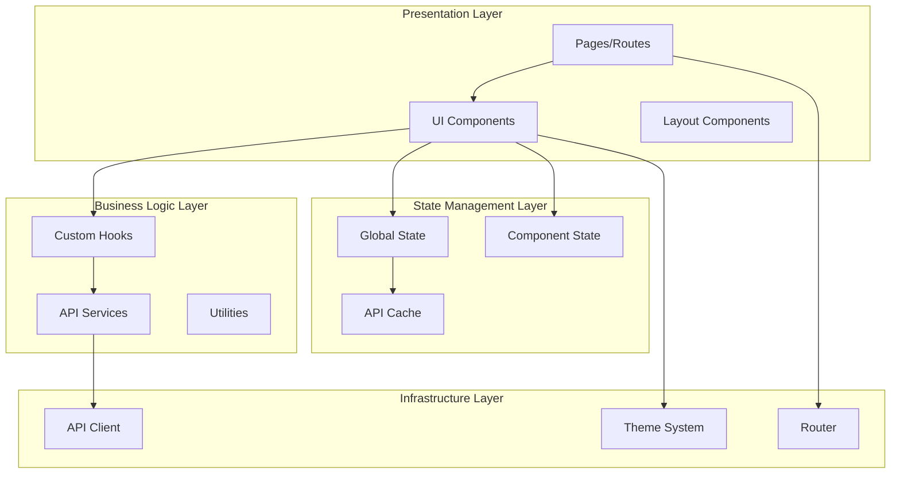

# Frontend Architecture Document - Design

## Overview

This design document provides a comprehensive frontend architecture that complements the main system architecture. It defines specific patterns, structures, and implementations for frontend development using modern frameworks and best practices.

## Architecture

### Frontend Architecture Layers



### Component Architecture Design

The frontend follows a hierarchical component architecture:

- **Pages**: Top-level route components that compose layouts and features
- **Layouts**: Reusable layout components for consistent page structure
- **Features**: Business logic components that implement specific functionality
- **UI Components**: Reusable, presentational components
- **Hooks**: Custom hooks for shared logic and state management
- **Services**: API integration and external service communication

## Components and Interfaces

### Core Component Structure

#### 1. Page Components
**Purpose**: Top-level route components that orchestrate page functionality
**Structure**:
```typescript
// pages/UserDashboard.tsx
interface UserDashboardProps {
  userId: string;
}

export const UserDashboard: React.FC<UserDashboardProps> = ({ userId }) => {
  const { user, loading, error } = useUser(userId);
  
  if (loading) return <LoadingSpinner />;
  if (error) return <ErrorBoundary error={error} />;
  
  return (
    <DashboardLayout>
      <UserProfile user={user} />
      <UserActivity userId={userId} />
    </DashboardLayout>
  );
};
```

#### 2. Layout Components
**Purpose**: Provide consistent page structure and navigation
**Structure**:
```typescript
// components/layouts/DashboardLayout.tsx
interface DashboardLayoutProps {
  children: React.ReactNode;
  sidebar?: React.ReactNode;
}

export const DashboardLayout: React.FC<DashboardLayoutProps> = ({ 
  children, 
  sidebar 
}) => {
  return (
    <div className="dashboard-layout">
      <Header />
      <div className="dashboard-content">
        {sidebar && <Sidebar>{sidebar}</Sidebar>}
        <main className="main-content">
          {children}
        </main>
      </div>
    </div>
  );
};
```

#### 3. Feature Components
**Purpose**: Implement specific business functionality
**Structure**:
```typescript
// components/features/UserProfile.tsx
interface UserProfileProps {
  user: User;
  onUpdate?: (user: User) => void;
}

export const UserProfile: React.FC<UserProfileProps> = ({ user, onUpdate }) => {
  const [isEditing, setIsEditing] = useState(false);
  const { updateUser, loading } = useUserMutation();
  
  const handleSave = async (updatedUser: User) => {
    await updateUser(updatedUser);
    onUpdate?.(updatedUser);
    setIsEditing(false);
  };
  
  return (
    <Card>
      <CardHeader>
        <CardTitle>User Profile</CardTitle>
        <Button onClick={() => setIsEditing(!isEditing)}>
          {isEditing ? 'Cancel' : 'Edit'}
        </Button>
      </CardHeader>
      <CardContent>
        {isEditing ? (
          <UserProfileForm user={user} onSave={handleSave} loading={loading} />
        ) : (
          <UserProfileDisplay user={user} />
        )}
      </CardContent>
    </Card>
  );
};
```

#### 4. UI Components
**Purpose**: Reusable, presentational components
**Structure**:
```typescript
// components/ui/Button.tsx
interface ButtonProps extends React.ButtonHTMLAttributes<HTMLButtonElement> {
  variant?: 'primary' | 'secondary' | 'outline' | 'ghost';
  size?: 'sm' | 'md' | 'lg';
  loading?: boolean;
  children: React.ReactNode;
}

export const Button: React.FC<ButtonProps> = ({
  variant = 'primary',
  size = 'md',
  loading = false,
  children,
  className,
  disabled,
  ...props
}) => {
  const baseClasses = 'btn';
  const variantClasses = `btn-${variant}`;
  const sizeClasses = `btn-${size}`;
  const loadingClasses = loading ? 'btn-loading' : '';
  
  return (
    <button
      className={cn(baseClasses, variantClasses, sizeClasses, loadingClasses, className)}
      disabled={disabled || loading}
      {...props}
    >
      {loading && <Spinner size="sm" />}
      {children}
    </button>
  );
};
```

### State Management Design

#### Global State Architecture
```typescript
// store/index.ts
interface AppState {
  auth: AuthState;
  user: UserState;
  ui: UIState;
}

interface AuthState {
  user: User | null;
  token: string | null;
  isAuthenticated: boolean;
  loading: boolean;
}

interface UserState {
  profile: UserProfile | null;
  preferences: UserPreferences;
  loading: boolean;
  error: string | null;
}

interface UIState {
  theme: 'light' | 'dark';
  sidebar: {
    isOpen: boolean;
    collapsed: boolean;
  };
  notifications: Notification[];
}
```

#### Custom Hooks Design
```typescript
// hooks/useUser.ts
interface UseUserReturn {
  user: User | null;
  loading: boolean;
  error: Error | null;
  refetch: () => Promise<void>;
}

export const useUser = (userId: string): UseUserReturn => {
  const [user, setUser] = useState<User | null>(null);
  const [loading, setLoading] = useState(true);
  const [error, setError] = useState<Error | null>(null);
  
  const fetchUser = useCallback(async () => {
    try {
      setLoading(true);
      setError(null);
      const userData = await userService.getUser(userId);
      setUser(userData);
    } catch (err) {
      setError(err as Error);
    } finally {
      setLoading(false);
    }
  }, [userId]);
  
  useEffect(() => {
    fetchUser();
  }, [fetchUser]);
  
  return { user, loading, error, refetch: fetchUser };
};
```

### API Integration Design

#### Service Layer Architecture
```typescript
// services/userService.ts
class UserService {
  private apiClient: APIClient;
  
  constructor(apiClient: APIClient) {
    this.apiClient = apiClient;
  }
  
  async getUser(id: string): Promise<User> {
    const response = await this.apiClient.get<User>(`/users/${id}`);
    return response.data;
  }
  
  async updateUser(id: string, updates: Partial<User>): Promise<User> {
    const response = await this.apiClient.put<User>(`/users/${id}`, updates);
    return response.data;
  }
  
  async deleteUser(id: string): Promise<void> {
    await this.apiClient.delete(`/users/${id}`);
  }
}

export const userService = new UserService(apiClient);
```

#### API Client Configuration
```typescript
// lib/apiClient.ts
interface APIClientConfig {
  baseURL: string;
  timeout: number;
  headers: Record<string, string>;
}

class APIClient {
  private config: APIClientConfig;
  private interceptors: {
    request: RequestInterceptor[];
    response: ResponseInterceptor[];
  };
  
  constructor(config: APIClientConfig) {
    this.config = config;
    this.interceptors = { request: [], response: [] };
    this.setupInterceptors();
  }
  
  private setupInterceptors() {
    // Add authentication interceptor
    this.addRequestInterceptor((config) => {
      const token = localStorage.getItem('auth_token');
      if (token) {
        config.headers.Authorization = `Bearer ${token}`;
      }
      return config;
    });
    
    // Add error handling interceptor
    this.addResponseInterceptor(
      (response) => response,
      (error) => {
        if (error.response?.status === 401) {
          // Handle authentication error
          authService.logout();
          window.location.href = '/login';
        }
        return Promise.reject(error);
      }
    );
  }
  
  async get<T>(url: string, config?: RequestConfig): Promise<APIResponse<T>> {
    // Implementation
  }
  
  async post<T>(url: string, data?: any, config?: RequestConfig): Promise<APIResponse<T>> {
    // Implementation
  }
  
  // ... other HTTP methods
}
```

## Data Models

### Frontend Data Models

#### Component Props Interfaces
```typescript
// types/components.ts
interface BaseComponentProps {
  className?: string;
  children?: React.ReactNode;
  testId?: string;
}

interface FormComponentProps extends BaseComponentProps {
  loading?: boolean;
  disabled?: boolean;
  error?: string;
}

interface DataComponentProps<T> extends BaseComponentProps {
  data: T;
  loading?: boolean;
  error?: Error | null;
  onRefresh?: () => void;
}
```

#### API Response Types
```typescript
// types/api.ts
interface APIResponse<T> {
  data: T;
  status: number;
  message?: string;
  meta?: {
    pagination?: PaginationMeta;
    timestamp: string;
  };
}

interface PaginationMeta {
  page: number;
  limit: number;
  total: number;
  totalPages: number;
}

interface APIError {
  code: string;
  message: string;
  details?: Record<string, any>;
  timestamp: string;
}
```

#### Form Data Models
```typescript
// types/forms.ts
interface FormState<T> {
  values: T;
  errors: Partial<Record<keyof T, string>>;
  touched: Partial<Record<keyof T, boolean>>;
  isSubmitting: boolean;
  isValid: boolean;
}

interface ValidationRule<T> {
  field: keyof T;
  validator: (value: any) => string | null;
  message: string;
}
```

## Error Handling

### Frontend Error Handling Strategy

#### Error Boundary Implementation
```typescript
// components/ErrorBoundary.tsx
interface ErrorBoundaryState {
  hasError: boolean;
  error: Error | null;
  errorInfo: ErrorInfo | null;
}

export class ErrorBoundary extends Component<
  { children: ReactNode; fallback?: ComponentType<{ error: Error }> },
  ErrorBoundaryState
> {
  constructor(props: any) {
    super(props);
    this.state = { hasError: false, error: null, errorInfo: null };
  }
  
  static getDerivedStateFromError(error: Error): ErrorBoundaryState {
    return { hasError: true, error, errorInfo: null };
  }
  
  componentDidCatch(error: Error, errorInfo: ErrorInfo) {
    this.setState({ errorInfo });
    
    // Log error to monitoring service
    errorService.logError(error, {
      componentStack: errorInfo.componentStack,
      errorBoundary: true
    });
  }
  
  render() {
    if (this.state.hasError) {
      const FallbackComponent = this.props.fallback || DefaultErrorFallback;
      return <FallbackComponent error={this.state.error!} />;
    }
    
    return this.props.children;
  }
}
```

#### API Error Handling
```typescript
// hooks/useErrorHandler.ts
interface UseErrorHandlerReturn {
  handleError: (error: Error) => void;
  clearError: () => void;
  error: string | null;
}

export const useErrorHandler = (): UseErrorHandlerReturn => {
  const [error, setError] = useState<string | null>(null);
  
  const handleError = useCallback((error: Error) => {
    if (error instanceof APIError) {
      setError(error.message);
      
      // Handle specific error types
      switch (error.code) {
        case 'VALIDATION_ERROR':
          // Handle validation errors
          break;
        case 'UNAUTHORIZED':
          // Handle auth errors
          authService.logout();
          break;
        case 'NETWORK_ERROR':
          // Handle network errors
          setError('Network connection error. Please try again.');
          break;
        default:
          setError('An unexpected error occurred.');
      }
    } else {
      setError(error.message || 'An unexpected error occurred.');
    }
    
    // Log error for monitoring
    errorService.logError(error);
  }, []);
  
  const clearError = useCallback(() => {
    setError(null);
  }, []);
  
  return { handleError, clearError, error };
};
```

## Testing Strategy

### Frontend Testing Architecture

#### Component Testing Strategy
```typescript
// __tests__/components/Button.test.tsx
import { render, screen, fireEvent } from '@testing-library/react';
import { Button } from '../Button';

describe('Button Component', () => {
  it('renders with correct text', () => {
    render(<Button>Click me</Button>);
    expect(screen.getByRole('button', { name: 'Click me' })).toBeInTheDocument();
  });
  
  it('handles click events', () => {
    const handleClick = jest.fn();
    render(<Button onClick={handleClick}>Click me</Button>);
    
    fireEvent.click(screen.getByRole('button'));
    expect(handleClick).toHaveBeenCalledTimes(1);
  });
  
  it('shows loading state', () => {
    render(<Button loading>Loading</Button>);
    
    expect(screen.getByRole('button')).toBeDisabled();
    expect(screen.getByTestId('spinner')).toBeInTheDocument();
  });
  
  it('applies correct variant classes', () => {
    render(<Button variant="secondary">Secondary</Button>);
    
    expect(screen.getByRole('button')).toHaveClass('btn-secondary');
  });
});
```

#### Hook Testing Strategy
```typescript
// __tests__/hooks/useUser.test.ts
import { renderHook, waitFor } from '@testing-library/react';
import { useUser } from '../useUser';
import { userService } from '../../services/userService';

jest.mock('../../services/userService');

describe('useUser Hook', () => {
  const mockUserService = userService as jest.Mocked<typeof userService>;
  
  beforeEach(() => {
    jest.clearAllMocks();
  });
  
  it('fetches user data on mount', async () => {
    const mockUser = { id: '1', name: 'John Doe' };
    mockUserService.getUser.mockResolvedValue(mockUser);
    
    const { result } = renderHook(() => useUser('1'));
    
    expect(result.current.loading).toBe(true);
    
    await waitFor(() => {
      expect(result.current.loading).toBe(false);
    });
    
    expect(result.current.user).toEqual(mockUser);
    expect(mockUserService.getUser).toHaveBeenCalledWith('1');
  });
  
  it('handles errors correctly', async () => {
    const mockError = new Error('User not found');
    mockUserService.getUser.mockRejectedValue(mockError);
    
    const { result } = renderHook(() => useUser('1'));
    
    await waitFor(() => {
      expect(result.current.loading).toBe(false);
    });
    
    expect(result.current.error).toEqual(mockError);
    expect(result.current.user).toBeNull();
  });
});
```

#### Integration Testing Strategy
```typescript
// __tests__/integration/UserProfile.test.tsx
import { render, screen, fireEvent, waitFor } from '@testing-library/react';
import { UserProfile } from '../components/features/UserProfile';
import { TestProviders } from '../__mocks__/TestProviders';

describe('UserProfile Integration', () => {
  it('allows user to edit and save profile', async () => {
    const mockUser = { id: '1', name: 'John Doe', email: 'john@example.com' };
    
    render(
      <TestProviders>
        <UserProfile user={mockUser} />
      </TestProviders>
    );
    
    // Click edit button
    fireEvent.click(screen.getByText('Edit'));
    
    // Update name field
    const nameInput = screen.getByLabelText('Name');
    fireEvent.change(nameInput, { target: { value: 'Jane Doe' } });
    
    // Save changes
    fireEvent.click(screen.getByText('Save'));
    
    // Wait for save to complete
    await waitFor(() => {
      expect(screen.getByText('Jane Doe')).toBeInTheDocument();
    });
    
    // Verify API was called
    expect(mockUserService.updateUser).toHaveBeenCalledWith('1', {
      name: 'Jane Doe'
    });
  });
});
```

---

**Template Reference:**
#[[file:.bmad-core/templates/front-end-architecture-tmpl.yaml]]