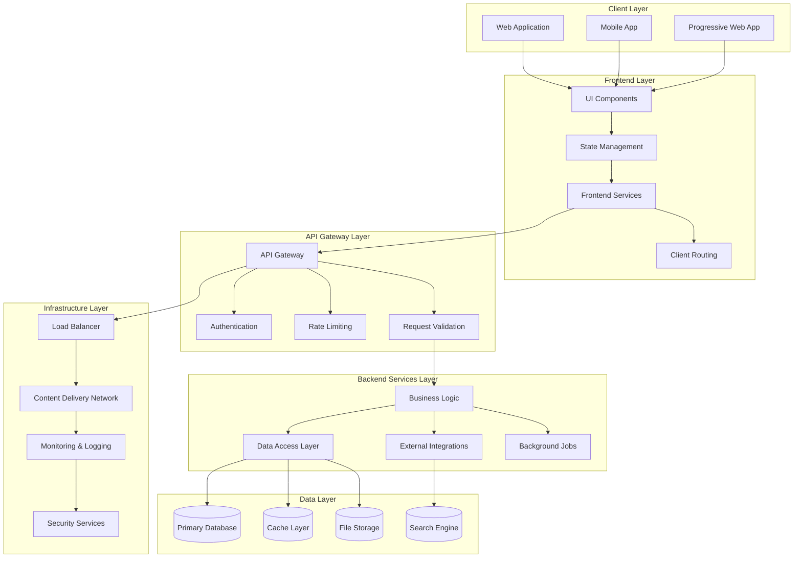

# Fullstack Architecture Document - Design

## Overview

This design document provides a comprehensive fullstack architecture that unifies frontend and backend concerns into a cohesive technical blueprint. The design enables efficient AI-driven development by providing clear patterns, interfaces, and implementation guidance for the entire technology stack.

## Architecture

### Unified Fullstack Architecture



### Monorepo Architecture Design

The fullstack application follows a monorepo structure that enables:
- **Shared Type Safety**: TypeScript interfaces shared between frontend and backend
- **Unified Build System**: Single build pipeline for entire stack
- **Code Reuse**: Shared utilities, validation, and business logic
- **Consistent Tooling**: Unified linting, testing, and deployment
- **Atomic Changes**: Frontend and backend changes deployed together

## Components and Interfaces

### Shared Type System

#### Core Domain Types
```typescript
// packages/shared/src/types/domain.ts
export interface User {
  id: string;
  email: string;
  username: string;
  profile: UserProfile;
  preferences: UserPreferences;
  createdAt: Date;
  updatedAt: Date;
}

export interface UserProfile {
  firstName: string;
  lastName: string;
  avatar?: string;
  bio?: string;
}

export interface UserPreferences {
  theme: 'light' | 'dark' | 'system';
  notifications: NotificationSettings;
  privacy: PrivacySettings;
}

export interface NotificationSettings {
  email: boolean;
  push: boolean;
  marketing: boolean;
}

export interface PrivacySettings {
  profileVisibility: 'public' | 'private' | 'friends';
  activityTracking: boolean;
}
```

#### API Contract Types
```typescript
// packages/shared/src/types/api.ts
export interface APIResponse<T> {
  data: T;
  status: 'success' | 'error';
  message?: string;
  meta?: ResponseMeta;
}

export interface ResponseMeta {
  pagination?: PaginationMeta;
  timestamp: string;
  requestId: string;
}

export interface PaginationMeta {
  page: number;
  limit: number;
  total: number;
  totalPages: number;
  hasNext: boolean;
  hasPrev: boolean;
}

export interface APIError {
  code: string;
  message: string;
  details?: Record<string, any>;
  field?: string;
}

// Request/Response types for each endpoint
export interface CreateUserRequest {
  email: string;
  username: string;
  password: string;
  profile: Omit<UserProfile, 'avatar'>;
}

export interface CreateUserResponse extends APIResponse<User> {}

export interface UpdateUserRequest {
  profile?: Partial<UserProfile>;
  preferences?: Partial<UserPreferences>;
}

export interface UpdateUserResponse extends APIResponse<User> {}
```

### Frontend Architecture Components

#### Component Architecture
```typescript
// apps/web/src/components/layouts/AppLayout.tsx
interface AppLayoutProps {
  children: React.ReactNode;
  sidebar?: React.ReactNode;
  header?: React.ReactNode;
}

export const AppLayout: React.FC<AppLayoutProps> = ({ 
  children, 
  sidebar, 
  header 
}) => {
  const { user } = useAuth();
  const { theme } = useTheme();
  
  return (
    <div className={`app-layout theme-${theme}`}>
      {header || <AppHeader user={user} />}
      <div className="app-content">
        {sidebar && <AppSidebar>{sidebar}</AppSidebar>}
        <main className="main-content">
          <ErrorBoundary>
            {children}
          </ErrorBoundary>
        </main>
      </div>
    </div>
  );
};
```

#### State Management Architecture
```typescript
// apps/web/src/store/index.ts
interface RootState {
  auth: AuthState;
  user: UserState;
  ui: UIState;
  api: APIState;
}

interface AuthState {
  user: User | null;
  token: string | null;
  isAuthenticated: boolean;
  loading: boolean;
  error: string | null;
}

interface UserState {
  profile: UserProfile | null;
  preferences: UserPreferences;
  loading: boolean;
  error: string | null;
}

interface UIState {
  theme: 'light' | 'dark' | 'system';
  sidebar: {
    isOpen: boolean;
    collapsed: boolean;
  };
  notifications: UINotification[];
  modals: ModalState[];
}

interface APIState {
  loading: Record<string, boolean>;
  errors: Record<string, APIError | null>;
  cache: Record<string, { data: any; timestamp: number; ttl: number }>;
}
```

#### API Client Architecture
```typescript
// apps/web/src/lib/apiClient.ts
class APIClient {
  private baseURL: string;
  private defaultHeaders: Record<string, string>;
  
  constructor(config: APIClientConfig) {
    this.baseURL = config.baseURL;
    this.defaultHeaders = config.headers || {};
    this.setupInterceptors();
  }
  
  private setupInterceptors() {
    // Request interceptor for authentication
    this.addRequestInterceptor((config) => {
      const token = authStore.getToken();
      if (token) {
        config.headers.Authorization = `Bearer ${token}`;
      }
      config.headers['X-Request-ID'] = generateRequestId();
      return config;
    });
    
    // Response interceptor for error handling
    this.addResponseInterceptor(
      (response) => {
        // Handle successful responses
        return response;
      },
      (error) => {
        // Handle errors globally
        if (error.response?.status === 401) {
          authStore.logout();
          router.push('/login');
        }
        
        // Log error for monitoring
        errorService.logError(error, {
          url: error.config?.url,
          method: error.config?.method,
          requestId: error.config?.headers['X-Request-ID']
        });
        
        return Promise.reject(error);
      }
    );
  }
  
  async get<T>(url: string, config?: RequestConfig): Promise<APIResponse<T>> {
    const response = await this.request<T>({ ...config, method: 'GET', url });
    return response.data;
  }
  
  async post<T>(url: string, data?: any, config?: RequestConfig): Promise<APIResponse<T>> {
    const response = await this.request<T>({ ...config, method: 'POST', url, data });
    return response.data;
  }
  
  // ... other HTTP methods
}

// Typed API service
export class UserService {
  constructor(private apiClient: APIClient) {}
  
  async getUser(id: string): Promise<User> {
    const response = await this.apiClient.get<User>(`/users/${id}`);
    return response.data;
  }
  
  async createUser(data: CreateUserRequest): Promise<User> {
    const response = await this.apiClient.post<User>('/users', data);
    return response.data;
  }
  
  async updateUser(id: string, data: UpdateUserRequest): Promise<User> {
    const response = await this.apiClient.put<User>(`/users/${id}`, data);
    return response.data;
  }
}
```

### Backend Architecture Components

#### Service Layer Architecture
```typescript
// apps/api/src/services/UserService.ts
export class UserService {
  constructor(
    private userRepository: UserRepository,
    private emailService: EmailService,
    private eventBus: EventBus
  ) {}
  
  async createUser(data: CreateUserRequest): Promise<User> {
    // Validate input
    const validationResult = await this.validateCreateUserData(data);
    if (!validationResult.isValid) {
      throw new ValidationError(validationResult.errors);
    }
    
    // Check if user already exists
    const existingUser = await this.userRepository.findByEmail(data.email);
    if (existingUser) {
      throw new ConflictError('User with this email already exists');
    }
    
    // Hash password
    const hashedPassword = await this.hashPassword(data.password);
    
    // Create user
    const user = await this.userRepository.create({
      ...data,
      password: hashedPassword,
      id: generateId(),
      createdAt: new Date(),
      updatedAt: new Date()
    });
    
    // Send welcome email
    await this.emailService.sendWelcomeEmail(user);
    
    // Publish user created event
    await this.eventBus.publish('user.created', { user });
    
    return user;
  }
  
  async updateUser(id: string, data: UpdateUserRequest): Promise<User> {
    const user = await this.userRepository.findById(id);
    if (!user) {
      throw new NotFoundError('User not found');
    }
    
    const updatedUser = await this.userRepository.update(id, {
      ...data,
      updatedAt: new Date()
    });
    
    await this.eventBus.publish('user.updated', { user: updatedUser });
    
    return updatedUser;
  }
  
  private async validateCreateUserData(data: CreateUserRequest): Promise<ValidationResult> {
    const errors: ValidationError[] = [];
    
    if (!isValidEmail(data.email)) {
      errors.push({ field: 'email', message: 'Invalid email format' });
    }
    
    if (!isValidPassword(data.password)) {
      errors.push({ field: 'password', message: 'Password must be at least 8 characters' });
    }
    
    return {
      isValid: errors.length === 0,
      errors
    };
  }
}
```

#### Repository Pattern Implementation
```typescript
// apps/api/src/repositories/UserRepository.ts
export interface UserRepository {
  create(user: CreateUserData): Promise<User>;
  findById(id: string): Promise<User | null>;
  findByEmail(email: string): Promise<User | null>;
  update(id: string, data: Partial<User>): Promise<User>;
  delete(id: string): Promise<void>;
  findMany(filters: UserFilters): Promise<PaginatedResult<User>>;
}

export class PostgresUserRepository implements UserRepository {
  constructor(private db: Database) {}
  
  async create(userData: CreateUserData): Promise<User> {
    const query = `
      INSERT INTO users (id, email, username, password_hash, created_at, updated_at)
      VALUES ($1, $2, $3, $4, $5, $6)
      RETURNING *
    `;
    
    const values = [
      userData.id,
      userData.email,
      userData.username,
      userData.password,
      userData.createdAt,
      userData.updatedAt
    ];
    
    const result = await this.db.query(query, values);
    return this.mapRowToUser(result.rows[0]);
  }
  
  async findById(id: string): Promise<User | null> {
    const query = `
      SELECT u.*, up.first_name, up.last_name, up.avatar_url
      FROM users u
      LEFT JOIN user_profiles up ON u.id = up.user_id
      WHERE u.id = $1
    `;
    
    const result = await this.db.query(query, [id]);
    return result.rows[0] ? this.mapRowToUser(result.rows[0]) : null;
  }
  
  private mapRowToUser(row: any): User {
    return {
      id: row.id,
      email: row.email,
      username: row.username,
      profile: {
        firstName: row.first_name,
        lastName: row.last_name,
        avatar: row.avatar_url
      },
      preferences: JSON.parse(row.preferences || '{}'),
      createdAt: row.created_at,
      updatedAt: row.updated_at
    };
  }
}
```

#### API Controller Architecture
```typescript
// apps/api/src/controllers/UserController.ts
export class UserController {
  constructor(
    private userService: UserService,
    private authService: AuthService
  ) {}
  
  @Post('/users')
  @ValidateBody(CreateUserRequestSchema)
  async createUser(req: Request, res: Response): Promise<void> {
    try {
      const userData = req.body as CreateUserRequest;
      const user = await this.userService.createUser(userData);
      
      res.status(201).json({
        data: user,
        status: 'success',
        message: 'User created successfully',
        meta: {
          timestamp: new Date().toISOString(),
          requestId: req.headers['x-request-id'] as string
        }
      });
    } catch (error) {
      this.handleError(error, res);
    }
  }
  
  @Get('/users/:id')
  @RequireAuth()
  async getUser(req: Request, res: Response): Promise<void> {
    try {
      const { id } = req.params;
      const currentUser = req.user as User;
      
      // Check if user can access this profile
      if (!this.canAccessProfile(currentUser, id)) {
        throw new ForbiddenError('Access denied');
      }
      
      const user = await this.userService.getUser(id);
      
      res.json({
        data: user,
        status: 'success',
        meta: {
          timestamp: new Date().toISOString(),
          requestId: req.headers['x-request-id'] as string
        }
      });
    } catch (error) {
      this.handleError(error, res);
    }
  }
  
  private handleError(error: Error, res: Response): void {
    if (error instanceof ValidationError) {
      res.status(400).json({
        status: 'error',
        message: 'Validation failed',
        errors: error.details
      });
    } else if (error instanceof NotFoundError) {
      res.status(404).json({
        status: 'error',
        message: error.message
      });
    } else if (error instanceof ConflictError) {
      res.status(409).json({
        status: 'error',
        message: error.message
      });
    } else {
      // Log unexpected errors
      logger.error('Unexpected error in UserController', error);
      
      res.status(500).json({
        status: 'error',
        message: 'Internal server error'
      });
    }
  }
}
```

## Data Models

### Unified Data Architecture

#### Database Schema Design
```sql
-- Users table
CREATE TABLE users (
    id UUID PRIMARY KEY DEFAULT gen_random_uuid(),
    email VARCHAR(255) UNIQUE NOT NULL,
    username VARCHAR(100) UNIQUE NOT NULL,
    password_hash VARCHAR(255) NOT NULL,
    email_verified BOOLEAN DEFAULT FALSE,
    created_at TIMESTAMP DEFAULT CURRENT_TIMESTAMP,
    updated_at TIMESTAMP DEFAULT CURRENT_TIMESTAMP,
    deleted_at TIMESTAMP NULL
);

-- User profiles table
CREATE TABLE user_profiles (
    id UUID PRIMARY KEY DEFAULT gen_random_uuid(),
    user_id UUID REFERENCES users(id) ON DELETE CASCADE,
    first_name VARCHAR(100),
    last_name VARCHAR(100),
    avatar_url TEXT,
    bio TEXT,
    created_at TIMESTAMP DEFAULT CURRENT_TIMESTAMP,
    updated_at TIMESTAMP DEFAULT CURRENT_TIMESTAMP
);

-- User preferences table
CREATE TABLE user_preferences (
    id UUID PRIMARY KEY DEFAULT gen_random_uuid(),
    user_id UUID REFERENCES users(id) ON DELETE CASCADE,
    theme VARCHAR(20) DEFAULT 'system',
    email_notifications BOOLEAN DEFAULT TRUE,
    push_notifications BOOLEAN DEFAULT TRUE,
    marketing_notifications BOOLEAN DEFAULT FALSE,
    profile_visibility VARCHAR(20) DEFAULT 'public',
    activity_tracking BOOLEAN DEFAULT TRUE,
    created_at TIMESTAMP DEFAULT CURRENT_TIMESTAMP,
    updated_at TIMESTAMP DEFAULT CURRENT_TIMESTAMP
);

-- Indexes for performance
CREATE INDEX idx_users_email ON users(email);
CREATE INDEX idx_users_username ON users(username);
CREATE INDEX idx_user_profiles_user_id ON user_profiles(user_id);
CREATE INDEX idx_user_preferences_user_id ON user_preferences(user_id);
CREATE INDEX idx_users_created_at ON users(created_at);
```

#### Data Access Layer Design
```typescript
// packages/shared/src/database/migrations/001_create_users.ts
export class CreateUsersTable implements Migration {
  async up(db: Database): Promise<void> {
    await db.query(`
      CREATE TABLE users (
        id UUID PRIMARY KEY DEFAULT gen_random_uuid(),
        email VARCHAR(255) UNIQUE NOT NULL,
        username VARCHAR(100) UNIQUE NOT NULL,
        password_hash VARCHAR(255) NOT NULL,
        email_verified BOOLEAN DEFAULT FALSE,
        created_at TIMESTAMP DEFAULT CURRENT_TIMESTAMP,
        updated_at TIMESTAMP DEFAULT CURRENT_TIMESTAMP,
        deleted_at TIMESTAMP NULL
      )
    `);
    
    await db.query(`
      CREATE INDEX idx_users_email ON users(email)
    `);
  }
  
  async down(db: Database): Promise<void> {
    await db.query('DROP TABLE users');
  }
}
```

## Error Handling

### Unified Error Handling Strategy

#### Error Type System
```typescript
// packages/shared/src/errors/index.ts
export abstract class AppError extends Error {
  abstract readonly statusCode: number;
  abstract readonly code: string;
  abstract readonly isOperational: boolean;
  
  constructor(message: string, public readonly details?: any) {
    super(message);
    this.name = this.constructor.name;
    Error.captureStackTrace(this, this.constructor);
  }
}

export class ValidationError extends AppError {
  readonly statusCode = 400;
  readonly code = 'VALIDATION_ERROR';
  readonly isOperational = true;
  
  constructor(message: string, public readonly fields: ValidationFieldError[]) {
    super(message, { fields });
  }
}

export class NotFoundError extends AppError {
  readonly statusCode = 404;
  readonly code = 'NOT_FOUND';
  readonly isOperational = true;
}

export class ConflictError extends AppError {
  readonly statusCode = 409;
  readonly code = 'CONFLICT';
  readonly isOperational = true;
}

export class UnauthorizedError extends AppError {
  readonly statusCode = 401;
  readonly code = 'UNAUTHORIZED';
  readonly isOperational = true;
}

export class ForbiddenError extends AppError {
  readonly statusCode = 403;
  readonly code = 'FORBIDDEN';
  readonly isOperational = true;
}
```

#### Global Error Handler
```typescript
// apps/api/src/middleware/errorHandler.ts
export const errorHandler = (
  error: Error,
  req: Request,
  res: Response,
  next: NextFunction
): void => {
  // Log error
  logger.error('Error occurred', {
    error: error.message,
    stack: error.stack,
    url: req.url,
    method: req.method,
    requestId: req.headers['x-request-id'],
    userId: req.user?.id
  });
  
  // Handle known application errors
  if (error instanceof AppError) {
    res.status(error.statusCode).json({
      status: 'error',
      code: error.code,
      message: error.message,
      details: error.details,
      meta: {
        timestamp: new Date().toISOString(),
        requestId: req.headers['x-request-id']
      }
    });
    return;
  }
  
  // Handle unexpected errors
  res.status(500).json({
    status: 'error',
    code: 'INTERNAL_SERVER_ERROR',
    message: 'An unexpected error occurred',
    meta: {
      timestamp: new Date().toISOString(),
      requestId: req.headers['x-request-id']
    }
  });
};
```

## Testing Strategy

### Comprehensive Testing Architecture

#### Testing Structure
```
tests/
├── unit/                          # Unit tests (70%)
│   ├── frontend/
│   │   ├── components/           # Component unit tests
│   │   ├── hooks/               # Custom hook tests
│   │   ├── services/            # Frontend service tests
│   │   └── utils/               # Utility function tests
│   ├── backend/
│   │   ├── services/            # Business logic tests
│   │   ├── repositories/        # Data access tests
│   │   ├── controllers/         # Controller tests
│   │   └── utils/               # Backend utility tests
│   └── shared/
│       ├── types/               # Type validation tests
│       ├── utils/               # Shared utility tests
│       └── validation/          # Validation schema tests
├── integration/                   # Integration tests (20%)
│   ├── api/                     # API endpoint tests
│   │   ├── auth/               # Authentication flow tests
│   │   ├── users/              # User management tests
│   │   └── health/             # Health check tests
│   ├── database/               # Database integration tests
│   └── external/               # External service tests
├── e2e/                          # End-to-end tests (10%)
│   ├── user-flows/             # Critical user journey tests
│   │   ├── registration.spec.ts
│   │   ├── login.spec.ts
│   │   └── profile-management.spec.ts
│   └── smoke/                  # Basic functionality tests
├── fixtures/                     # Test data and mocks
│   ├── users.json
│   ├── api-responses.json
│   └── database-seeds.sql
└── helpers/                      # Test utilities and setup
    ├── test-server.ts
    ├── database-helper.ts
    └── mock-factories.ts
```

#### Test Implementation Examples
```typescript
// tests/unit/backend/services/UserService.test.ts
describe('UserService', () => {
  let userService: UserService;
  let mockUserRepository: jest.Mocked<UserRepository>;
  let mockEmailService: jest.Mocked<EmailService>;
  let mockEventBus: jest.Mocked<EventBus>;
  
  beforeEach(() => {
    mockUserRepository = createMockUserRepository();
    mockEmailService = createMockEmailService();
    mockEventBus = createMockEventBus();
    
    userService = new UserService(
      mockUserRepository,
      mockEmailService,
      mockEventBus
    );
  });
  
  describe('createUser', () => {
    it('should create user successfully', async () => {
      // Arrange
      const userData: CreateUserRequest = {
        email: 'test@example.com',
        username: 'testuser',
        password: 'password123',
        profile: { firstName: 'Test', lastName: 'User' }
      };
      
      const expectedUser: User = {
        id: 'user-123',
        ...userData,
        createdAt: new Date(),
        updatedAt: new Date()
      };
      
      mockUserRepository.findByEmail.mockResolvedValue(null);
      mockUserRepository.create.mockResolvedValue(expectedUser);
      
      // Act
      const result = await userService.createUser(userData);
      
      // Assert
      expect(result).toEqual(expectedUser);
      expect(mockUserRepository.create).toHaveBeenCalledWith(
        expect.objectContaining({
          email: userData.email,
          username: userData.username
        })
      );
      expect(mockEmailService.sendWelcomeEmail).toHaveBeenCalledWith(expectedUser);
      expect(mockEventBus.publish).toHaveBeenCalledWith('user.created', { user: expectedUser });
    });
    
    it('should throw ConflictError if user already exists', async () => {
      // Arrange
      const userData: CreateUserRequest = {
        email: 'existing@example.com',
        username: 'existinguser',
        password: 'password123',
        profile: { firstName: 'Existing', lastName: 'User' }
      };
      
      mockUserRepository.findByEmail.mockResolvedValue({} as User);
      
      // Act & Assert
      await expect(userService.createUser(userData)).rejects.toThrow(ConflictError);
      expect(mockUserRepository.create).not.toHaveBeenCalled();
    });
  });
});
```

---

**Template Reference:**
#[[file:.bmad-core/templates/fullstack-architecture-tmpl.yaml]]