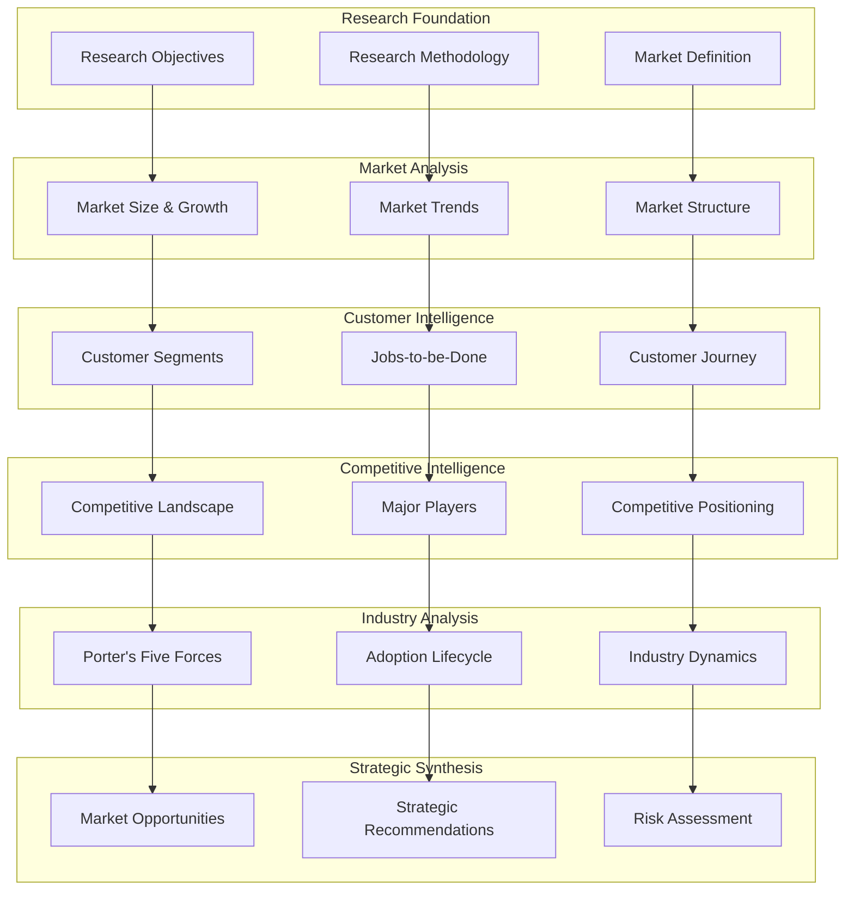

# Market Research Report - Design

## Overview

This design document outlines the structure and methodology for creating comprehensive market research reports following BMAD methodology. The design ensures systematic market analysis, customer insight development, and strategic recommendation formulation based on rigorous research frameworks.

## Architecture

### Market Research Framework



### Research Methodology Design

The market research follows a systematic approach:

1. **Foundation Setting**: Define objectives, methodology, and market scope
2. **Market Quantification**: Size markets using multiple approaches (TAM/SAM/SOM)
3. **Customer Analysis**: Deep dive into customer segments, needs, and journeys
4. **Competitive Assessment**: Analyze competitive landscape and positioning
5. **Industry Evaluation**: Apply analytical frameworks (Porter's Five Forces)
6. **Strategic Synthesis**: Develop actionable recommendations and risk mitigation

## Components and Interfaces

### Research Framework Components

#### 1. Market Sizing Component
**Purpose**: Quantify market opportunity using multiple methodologies
**Interfaces**:
- TAM (Total Addressable Market) calculation
- SAM (Serviceable Addressable Market) definition
- SOM (Serviceable Obtainable Market) estimation
- Multiple sizing approaches (top-down, bottom-up, value theory)

#### 2. Customer Analysis Component
**Purpose**: Understand customer segments, needs, and behaviors
**Interfaces**:
- Segment profiling with demographics and psychographics
- Jobs-to-be-Done framework application
- Customer journey mapping across all touchpoints
- Willingness to pay and price sensitivity analysis

#### 3. Competitive Intelligence Component
**Purpose**: Analyze competitive landscape and market dynamics
**Interfaces**:
- Market structure assessment
- Major player analysis and positioning
- Competitive gap identification
- Market opportunity mapping

#### 4. Industry Analysis Component
**Purpose**: Evaluate industry structure and competitive forces
**Interfaces**:
- Porter's Five Forces framework
- Technology adoption lifecycle assessment
- Industry trend analysis
- Regulatory and environmental factor evaluation

#### 5. Strategic Synthesis Component
**Purpose**: Develop actionable recommendations and strategies
**Interfaces**:
- Market opportunity prioritization
- Go-to-market strategy development
- Pricing strategy recommendations
- Risk assessment and mitigation planning

### Data Model Design

#### Market Sizing Data Structure
```typescript
interface MarketSizing {
  tam: {
    value: number;
    currency: string;
    methodology: 'top-down' | 'bottom-up' | 'value-theory';
    assumptions: string[];
    sources: string[];
    confidence: 'High' | 'Medium' | 'Low';
  };
  
  sam: {
    value: number;
    currency: string;
    rationale: string;
    constraints: string[];
    addressableSegments: string[];
  };
  
  som: {
    value: number;
    currency: string;
    timeframe: string;
    captureRate: number;
    assumptions: string[];
  };
  
  growth: {
    historicalGrowth: GrowthData[];
    projectedGrowth: GrowthData[];
    growthDrivers: string[];
    inhibitors: string[];
  };
}

interface GrowthData {
  year: number;
  marketSize: number;
  growthRate: number;
  source: string;
}
```

#### Customer Segment Data Structure
```typescript
interface CustomerSegment {
  id: string;
  name: string;
  size: {
    customers: number;
    marketValue: number;
    percentage: number;
  };
  
  profile: {
    demographics: Record<string, any>;
    firmographics: Record<string, any>;
    psychographics: string[];
    behaviors: string[];
  };
  
  needs: {
    primaryNeeds: string[];
    painPoints: string[];
    unmetNeeds: string[];
    importance: Record<string, number>; // 1-5 scale
  };
  
  buyingProcess: {
    decisionMakers: string[];
    influencers: string[];
    buyingCriteria: string[];
    purchaseProcess: string[];
    cycleLength: string;
  };
  
  economics: {
    willingnessToPay: PriceRange;
    priceSensitivity: 'High' | 'Medium' | 'Low';
    budgetConstraints: string[];
  };
}

interface PriceRange {
  min: number;
  max: number;
  optimal: number;
  currency: string;
}
```

#### Jobs-to-be-Done Data Structure
```typescript
interface JobsToBeDone {
  functionalJobs: Job[];
  emotionalJobs: Job[];
  socialJobs: Job[];
}

interface Job {
  description: string;
  importance: number; // 1-10 scale
  satisfaction: number; // 1-10 scale
  opportunityScore: number; // importance + (importance - satisfaction)
  segments: string[]; // which segments have this job
  currentSolutions: string[];
  unmetAspects: string[];
}
```

#### Competitive Analysis Data Structure
```typescript
interface CompetitiveAnalysis {
  marketStructure: {
    numberOfCompetitors: number;
    concentration: 'Fragmented' | 'Moderately Concentrated' | 'Highly Concentrated';
    competitiveIntensity: 'Low' | 'Medium' | 'High';
    entryBarriers: string[];
  };
  
  majorPlayers: Competitor[];
  
  positioning: {
    dimensions: PositioningDimension[];
    competitorPositions: CompetitorPosition[];
    gaps: MarketGap[];
  };
}

interface Competitor {
  name: string;
  marketShare: number;
  strengths: string[];
  weaknesses: string[];
  targetSegments: string[];
  valueProposition: string;
  pricingStrategy: string;
}

interface PositioningDimension {
  name: string;
  lowEnd: string;
  highEnd: string;
}

interface CompetitorPosition {
  competitor: string;
  dimensions: Record<string, number>; // dimension name -> position (1-10)
}
```

#### Porter's Five Forces Data Structure
```typescript
interface PortersFiveForces {
  supplierPower: ForceAnalysis;
  buyerPower: ForceAnalysis;
  competitiveRivalry: ForceAnalysis;
  threatOfNewEntry: ForceAnalysis;
  threatOfSubstitutes: ForceAnalysis;
  
  overallAttractiveness: 'High' | 'Medium' | 'Low';
  strategicImplications: string[];
}

interface ForceAnalysis {
  strength: 'High' | 'Medium' | 'Low';
  factors: string[];
  implications: string[];
  evidence: string[];
}
```

## Data Models

### Market Research Data Architecture

#### Research Methodology Model
```typescript
interface ResearchMethodology {
  objectives: {
    primary: string[];
    secondary: string[];
    successCriteria: string[];
  };
  
  approach: {
    primaryResearch: ResearchMethod[];
    secondaryResearch: ResearchMethod[];
    analyticalFrameworks: string[];
  };
  
  scope: {
    timeframe: string;
    geography: string[];
    segments: string[];
    limitations: string[];
  };
  
  dataQuality: {
    confidenceLevels: Record<string, 'High' | 'Medium' | 'Low'>;
    assumptions: string[];
    biases: string[];
    mitigations: string[];
  };
}

interface ResearchMethod {
  method: string;
  description: string;
  sources: string[];
  sampleSize?: number;
  confidence?: string;
}
```

#### Market Opportunity Model
```typescript
interface MarketOpportunity {
  id: string;
  name: string;
  description: string;
  
  potential: {
    marketSize: number;
    growthRate: number;
    timeToMarket: string;
    revenueProjection: number[];
  };
  
  requirements: {
    capabilities: string[];
    resources: string[];
    partnerships: string[];
    timeline: string;
  };
  
  risks: {
    marketRisks: Risk[];
    competitiveRisks: Risk[];
    executionRisks: Risk[];
  };
  
  priority: 'High' | 'Medium' | 'Low';
  confidence: 'High' | 'Medium' | 'Low';
}

interface Risk {
  description: string;
  probability: 'High' | 'Medium' | 'Low';
  impact: 'High' | 'Medium' | 'Low';
  mitigation: string;
}
```

## Error Handling

### Research Quality Assurance

#### Data Validation Strategy
```typescript
interface ResearchValidation {
  dataQuality: {
    sourceCredibility: QualityCheck;
    dataRecency: QualityCheck;
    sampleSize: QualityCheck;
    methodology: QualityCheck;
  };
  
  analysisQuality: {
    frameworkApplication: QualityCheck;
    logicalConsistency: QualityCheck;
    evidenceSupport: QualityCheck;
    biasAssessment: QualityCheck;
  };
  
  strategicValue: {
    objectiveAlignment: QualityCheck;
    actionability: QualityCheck;
    feasibility: QualityCheck;
    completeness: QualityCheck;
  };
}

interface QualityCheck {
  status: 'Pass' | 'Warning' | 'Fail';
  score: number; // 1-10
  issues: string[];
  recommendations: string[];
}
```

#### Quality Control Measures
- **Source Triangulation**: Validate findings across multiple data sources
- **Methodology Consistency**: Apply analytical frameworks consistently
- **Peer Review**: Multiple researcher validation of findings
- **Stakeholder Validation**: Confirm findings with industry experts
- **Sensitivity Analysis**: Test assumptions and model robustness

### Error Recovery Patterns

#### Data Quality Issues
- **Missing Data**: Identify gaps and suggest additional research
- **Conflicting Data**: Document conflicts and provide resolution approach
- **Outdated Data**: Flag stale information and recommend updates
- **Biased Sources**: Identify potential biases and adjust analysis

#### Analysis Consistency Issues
- **Framework Misapplication**: Correct analytical framework usage
- **Logical Inconsistencies**: Identify and resolve reasoning gaps
- **Unsupported Conclusions**: Strengthen evidence base for claims
- **Missing Perspectives**: Incorporate additional viewpoints and scenarios

## Testing Strategy

### Research Validation Framework

#### Content Quality Testing
1. **Data Source Validation**: Verify credibility and reliability of sources
2. **Methodology Testing**: Validate proper application of research methods
3. **Analysis Consistency**: Check internal consistency across sections
4. **Completeness Testing**: Ensure all research objectives are addressed

#### Analytical Rigor Testing
1. **Framework Application**: Verify proper use of analytical frameworks
2. **Logic Validation**: Check reasoning and conclusion validity
3. **Evidence Support**: Validate claims with supporting data
4. **Bias Assessment**: Identify and address potential research biases

#### Strategic Value Testing
1. **Objective Alignment**: Ensure research addresses stated objectives
2. **Actionability Testing**: Verify recommendations are actionable
3. **Feasibility Assessment**: Evaluate recommendation practicality
4. **Strategic Impact**: Assess potential business impact of findings

### Quality Assurance Process

#### Research Review Checkpoints
- **Methodology Review**: Validate research approach and data sources
- **Analysis Review**: Check analytical rigor and framework application
- **Findings Review**: Assess conclusion validity and evidence support
- **Strategic Review**: Evaluate strategic value and recommendation quality

#### Continuous Improvement
- **Feedback Integration**: Incorporate stakeholder feedback systematically
- **Methodology Refinement**: Improve research methods based on outcomes
- **Template Evolution**: Update templates based on usage patterns
- **Best Practice Documentation**: Capture and share successful approaches

---

**Template Reference:**
#[[file:.bmad-core/templates/market-research-tmpl.yaml]]