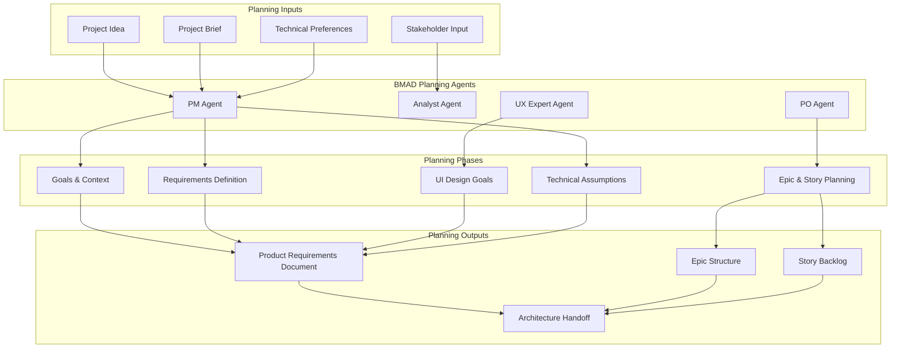

# Planning Workflow Design

## Overview

This design document outlines the architecture for the BMAD Planning Workflow, which transforms initial project concepts into comprehensive Product Requirements Documents (PRDs) through structured elicitation, iterative refinement, and stakeholder collaboration.

The design follows BMAD methodology principles of agent specialization, clean handoffs, and document-driven development, ensuring that planning outputs provide a solid foundation for technical architecture and implementation.

## Architecture

### Planning Workflow Architecture



### Workflow Phases

The planning workflow consists of five sequential phases, each building upon the previous phase's outputs:

1. **Goals & Context Phase**: Establish project foundation and purpose
2. **Requirements Phase**: Define functional and non-functional requirements
3. **UI Goals Phase**: Capture user experience vision and design goals
4. **Technical Assumptions Phase**: Document technology choices and constraints
5. **Epic Planning Phase**: Structure work into deliverable increments

## Components and Interfaces

### 1. Goals & Context Component

#### Purpose
Establishes the foundational understanding of what the project aims to achieve and why it's needed.

#### Key Interfaces
- **Input**: Project ideas, existing briefs, stakeholder vision
- **Output**: Structured goals list, background context, change tracking

#### Implementation Details
- References existing project briefs when available
- Recommends brief creation when missing
- Maintains document versioning through change logs
- Uses BMAD elicitation techniques for completeness

### 2. Requirements Definition Component

#### Purpose
Captures comprehensive functional and non-functional requirements with clear identifiers and specifications.

#### Key Interfaces
- **Input**: Goals and context, stakeholder needs
- **Output**: Numbered FR/NFR lists with unique identifiers

#### Implementation Details
- Separates functional (FR) from non-functional (NFR) requirements
- Assigns unique identifiers for traceability
- Uses interactive elicitation for requirement completeness
- Validates requirements against project goals

### 3. UI Design Goals Component

#### Purpose
Defines high-level user experience vision and interface requirements to guide technical architecture.

#### Key Interfaces
- **Input**: Project goals, user needs, platform requirements
- **Output**: UX vision, interaction paradigms, platform specifications

#### Implementation Details
- Conditional activation based on UI requirements
- Standardized accessibility options (WCAG compliance levels)
- Platform targeting (Web, Mobile, Desktop, Cross-platform)
- Branding and visual identity documentation

### 4. Technical Assumptions Component

#### Purpose
Documents early technical decisions and constraints that will guide architecture and implementation.

#### Key Interfaces
- **Input**: Technical preferences, project requirements, team capabilities
- **Output**: Technology stack decisions, architecture choices, testing requirements

#### Implementation Details
- References BMAD technical preferences configuration
- Documents repository structure decisions (Monorepo/Polyrepo)
- Specifies service architecture approach (Monolith/Microservices/Serverless)
- Establishes testing strategy and requirements

### 5. Epic Planning Component

#### Purpose
Structures project work into logical, sequential epics and detailed user stories with acceptance criteria.

#### Key Interfaces
- **Input**: All previous phase outputs, business priorities
- **Output**: Epic list, detailed stories, acceptance criteria

#### Implementation Details
- Ensures epic logical sequencing following agile best practices
- Creates "vertical slice" stories delivering complete functionality
- Sizes stories for AI agent execution (2-4 hour completion)
- Defines clear acceptance criteria for each story
- Identifies story dependencies and prerequisites

## Data Models

### Project Context Model
```
ProjectContext:
  - goals: List<String>
  - backgroundContext: String
  - changeLog: List<ChangeEntry>
  - projectBrief: Optional<ProjectBrief>
```

### Requirements Model
```
Requirements:
  - functionalRequirements: List<FunctionalRequirement>
  - nonFunctionalRequirements: List<NonFunctionalRequirement>

FunctionalRequirement:
  - id: String (FR prefix)
  - description: String
  - priority: Priority

NonFunctionalRequirement:
  - id: String (NFR prefix)
  - description: String
  - measurableCriteria: String
```

### UI Goals Model
```
UIGoals:
  - uxVision: String
  - interactionParadigms: List<String>
  - coreScreens: List<Screen>
  - accessibilityLevel: AccessibilityLevel
  - targetPlatforms: List<Platform>
  - brandingRequirements: Optional<BrandingSpec>
```

### Technical Assumptions Model
```
TechnicalAssumptions:
  - repositoryStructure: RepositoryType
  - serviceArchitecture: ArchitectureType
  - testingRequirements: TestingLevel
  - technologyChoices: Map<Category, TechnologyChoice>
  - additionalAssumptions: List<String>
```

### Epic Structure Model
```
Epic:
  - id: String
  - title: String
  - goal: String
  - stories: List<Story>

Story:
  - id: String
  - title: String
  - userStory: UserStoryTemplate
  - acceptanceCriteria: List<AcceptanceCriterion>
  - prerequisites: List<String>
```

## Error Handling

### Validation Rules
- All required fields must be completed before phase progression
- Epic sequencing must follow logical dependencies
- Story sizing must meet AI agent execution constraints
- Technical assumptions must align with project requirements

### Error Recovery
- Phase rollback capability for requirement changes
- Validation warnings for potential issues
- Guided correction prompts for common mistakes
- Checkpoint saves for work preservation

## Testing Strategy

### Template Validation
- Verify all BMAD template references are accessible
- Test file inclusion syntax functionality
- Validate Mermaid diagram rendering
- Confirm requirement traceability

### Workflow Testing
- Test phase progression and validation
- Verify agent handoff procedures
- Test rollback and correction capabilities
- Validate output format compliance

### Integration Testing
- Test with BMAD agent system
- Verify technical preferences integration
- Test project brief reference functionality
- Validate architecture handoff process

#[[file:.bmad-core/templates/architecture-tmpl.yaml]]