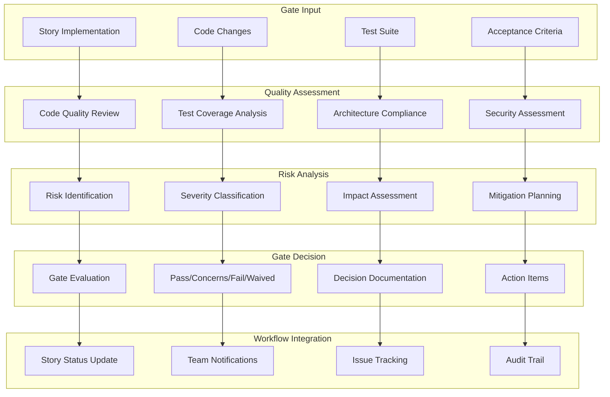

# Quality Gate Decision - Design

## Overview

This design document defines the structure and process for Quality Gate Decision documents in BMAD methodology. Quality gates provide systematic checkpoints to ensure code quality, testing coverage, and standards compliance before allowing progression through the development workflow.

## Architecture

### Quality Gate Framework



### Gate Decision Process Design

The quality gate follows a structured decision process:

1. **Input Validation**: Verify story implementation is complete and ready for review
2. **Quality Assessment**: Systematic evaluation across multiple quality dimensions
3. **Risk Analysis**: Identify, classify, and assess risks and issues
4. **Gate Decision**: Make informed decision based on assessment results
5. **Action Planning**: Define next steps and remediation requirements
6. **Workflow Integration**: Update story status and notify stakeholders

## Components and Interfaces

### Quality Gate Components

#### 1. Gate Decision Component
**Purpose**: Core gate decision and status tracking
**Structure**:
```yaml
# Core gate decision structure
gate: "PASS" | "CONCERNS" | "FAIL" | "WAIVED"
status_reason: "Brief summary of decision rationale"
reviewer: "Quinn (Test Architect)"
updated: "2025-01-26T10:30:00Z"
story: "1.2"
story_title: "User Authentication Implementation"
```

#### 2. Issue Management Component
**Purpose**: Systematic issue identification and tracking
**Structure**:
```yaml
# Issue classification structure
top_issues:
  - id: "SEC-001"
    severity: high  # ONLY: low|medium|high
    finding: "No rate limiting on login endpoint"
    suggested_action: "Add rate limiting middleware before production"
  - id: "TEST-001"
    severity: medium
    finding: "Missing integration tests for auth flow"
    suggested_action: "Add test coverage for critical paths"
```

#### 3. Waiver Management Component
**Purpose**: Handle approved exceptions and deviations
**Structure**:
```yaml
# Waiver management structure
waiver:
  active: true
  reason: "Accepted for MVP release - will address in next sprint"
  approved_by: "Product Owner"
  expires: "2025-02-15T00:00:00Z"
```

#### 4. Risk Assessment Component
**Purpose**: Comprehensive risk analysis and mitigation planning
**Structure**:
```yaml
# Risk assessment structure
risk_summary:
  totals:
    critical: 0
    high: 1
    medium: 2
    low: 0
  recommendations:
    must_fix:
      - action: "Add rate limiting to auth endpoints"
        refs: ["api/auth/login.ts:42-68"]
    monitor:
      - action: "Consider caching for better performance"
        refs: ["services/data.service.ts"]
```

#### 5. Evidence Tracking Component
**Purpose**: Document assessment evidence and traceability
**Structure**:
```yaml
# Evidence tracking structure
evidence:
  tests_reviewed: 15
  risks_identified: 3
  trace:
    ac_covered: [1, 2, 3]  # AC numbers with test coverage
    ac_gaps: [4]           # AC numbers lacking coverage
```

### Interface Design Patterns

#### Gate Status Interface
```typescript
enum GateStatus {
  PASS = 'PASS',
  CONCERNS = 'CONCERNS', 
  FAIL = 'FAIL',
  WAIVED = 'WAIVED'
}

interface GateDecision {
  gate: GateStatus;
  statusReason: string;
  reviewer: string;
  updated: string; // ISO timestamp
  story: string;
  storyTitle: string;
}
```

#### Issue Classification Interface
```typescript
enum IssueSeverity {
  LOW = 'low',
  MEDIUM = 'medium',
  HIGH = 'high'
}

interface QualityIssue {
  id: string;
  severity: IssueSeverity;
  finding: string;
  suggestedAction: string;
  codeReferences?: string[];
  category?: 'security' | 'performance' | 'testing' | 'standards';
}
```

#### Risk Assessment Interface
```typescript
interface RiskSummary {
  totals: {
    critical: number;
    high: number;
    medium: number;
    low: number;
  };
  recommendations: {
    mustFix: ActionItem[];
    monitor: ActionItem[];
  };
}

interface ActionItem {
  action: string;
  refs: string[];
  priority?: 'immediate' | 'before-production' | 'future';
  timeline?: string;
}
```

## Data Models

### Quality Gate Data Architecture

#### Core Gate Document Model
```typescript
interface QualityGateDocument {
  // Required core fields
  schema: number;
  story: string;
  storyTitle: string;
  gate: GateStatus;
  statusReason: string;
  reviewer: string;
  updated: string;
  
  // Issue management
  topIssues: QualityIssue[];
  
  // Risk assessment
  riskSummary: RiskSummary;
  
  // Waiver management
  waiver: {
    active: boolean;
    reason?: string;
    approvedBy?: string;
    expires?: string;
  };
  
  // Optional extended fields
  qualityScore?: number;
  expires?: string;
  evidence?: Evidence;
  nfrValidation?: NFRValidation;
  history?: HistoryEntry[];
  recommendations?: Recommendations;
}
```

#### Evidence and Traceability Model
```typescript
interface Evidence {
  testsReviewed: number;
  risksIdentified: number;
  trace: {
    acCovered: number[];
    acGaps: number[];
  };
  codeReviewScope: {
    filesReviewed: number;
    linesOfCode: number;
    complexity: 'low' | 'medium' | 'high';
  };
}
```

#### NFR Validation Model
```typescript
interface NFRValidation {
  security: {
    status: GateStatus;
    notes: string;
    findings: string[];
  };
  performance: {
    status: GateStatus;
    notes: string;
    metrics: PerformanceMetrics;
  };
  reliability: {
    status: GateStatus;
    notes: string;
    errorHandling: string[];
  };
  maintainability: {
    status: GateStatus;
    notes: string;
    codeQuality: CodeQualityMetrics;
  };
}

interface PerformanceMetrics {
  responseTime: number;
  memoryUsage: number;
  cpuUtilization: number;
  throughput: number;
}

interface CodeQualityMetrics {
  complexity: number;
  duplication: number;
  coverage: number;
  maintainabilityIndex: number;
}
```

#### History and Audit Model
```typescript
interface HistoryEntry {
  at: string; // ISO timestamp
  gate: GateStatus;
  note: string;
  reviewer: string;
  changes: string[];
}

interface Recommendations {
  immediate: ActionItem[];
  future: ActionItem[];
  technical_debt: TechnicalDebtItem[];
}

interface TechnicalDebtItem {
  description: string;
  impact: 'high' | 'medium' | 'low';
  effort: 'small' | 'medium' | 'large';
  refs: string[];
}
```

## Error Handling

### Quality Gate Validation

#### Gate Decision Validation
```typescript
interface GateValidation {
  isValid: boolean;
  errors: ValidationError[];
  warnings: ValidationWarning[];
}

interface ValidationError {
  field: string;
  message: string;
  severity: 'critical' | 'high' | 'medium';
}

interface ValidationWarning {
  field: string;
  message: string;
  recommendation: string;
}
```

#### Quality Control Measures
- **Required Field Validation**: Ensure all mandatory fields are populated
- **Severity Consistency**: Validate issue severity aligns with gate decision
- **Evidence Validation**: Verify evidence supports gate decision
- **Waiver Validation**: Ensure waivers have proper approval and justification
- **Timeline Validation**: Check gate freshness and expiration dates

### Error Recovery Patterns

#### Incomplete Assessment Recovery
- **Missing Evidence**: Request additional testing or code review
- **Insufficient Coverage**: Identify gaps and require additional tests
- **Unclear Issues**: Request clarification and specific remediation steps
- **Invalid Severity**: Correct severity classification based on impact

#### Process Compliance Recovery
- **Unauthorized Waiver**: Require proper approval authority
- **Expired Gate**: Trigger re-evaluation and fresh assessment
- **Missing Traceability**: Establish links to acceptance criteria and requirements
- **Inconsistent Decision**: Align gate decision with identified issues and evidence

## Testing Strategy

### Quality Gate Testing Framework

#### Gate Decision Testing
1. **Decision Logic Testing**: Verify gate decisions align with assessment results
2. **Severity Classification Testing**: Validate issue severity assignments
3. **Waiver Process Testing**: Test waiver approval and management workflow
4. **Evidence Validation Testing**: Verify evidence supports conclusions

#### Integration Testing
1. **Story Workflow Integration**: Test gate integration with story status updates
2. **Tool Integration Testing**: Validate integration with code analysis tools
3. **Notification Testing**: Verify stakeholder notification processes
4. **Audit Trail Testing**: Test history tracking and audit capabilities

#### Quality Assurance Testing
1. **Consistency Testing**: Verify consistent application of quality standards
2. **Completeness Testing**: Ensure all quality dimensions are assessed
3. **Traceability Testing**: Validate links between issues and code references
4. **Compliance Testing**: Verify adherence to quality gate process

### Continuous Improvement

#### Gate Effectiveness Metrics
- **Gate Accuracy**: Percentage of gates that correctly predict production issues
- **Issue Detection Rate**: Percentage of production issues caught by gates
- **False Positive Rate**: Percentage of gates that fail without real issues
- **Resolution Time**: Average time to resolve gate-identified issues

#### Process Optimization
- **Gate Criteria Refinement**: Improve quality criteria based on outcomes
- **Tool Integration Enhancement**: Optimize tool integration for better coverage
- **Reviewer Training**: Improve reviewer consistency and effectiveness
- **Template Evolution**: Update templates based on usage patterns and feedback

---

**Template Reference:**
#[[file:.bmad-core/templates/qa-gate-tmpl.yaml]]